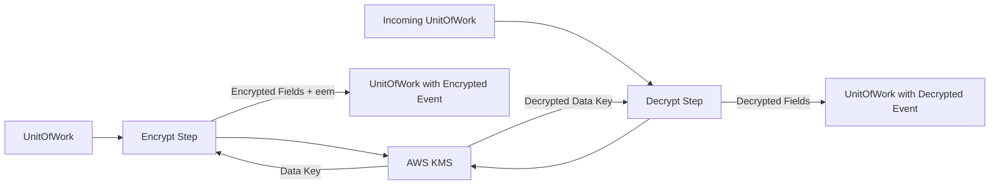

# Requirements

### Overview & Goals
Implement envelope encryption functionality in Kotlin, replicating the behavior of the `aws-kms-ee` based JavaScript implementation in the framework reference. This will allow for field-level encryption of events and data items using AWS KMS, ensuring sensitive data is protected at rest and in transit while maintaining the framework's pipeline patterns.

### Scope
- **In Scope**:
    - Proper definition of `EnvelopeEncryptionMetadata` (`eem` field).
    - KMS-based envelope encryption using AWS SDK v2 for Kotlin.
    - Field-level encryption for `Event` objects (via JSON transformation).
    - Field-level encryption for DynamoDB items (`Map<String, AttributeValue>`).
    - Multi-region KMS support.
    - Pipeline operators for encryption and decryption.
    - Integration into `CdcPipeline`.
- **Out of Scope**:
    - Support for encryption algorithms other than AES-GCM (unless specifically required later).
    - Automatic encryption of all events (it must be opt-in per pipeline/field).

# Technical Design

### Current Implementation
- The `Event` interface already includes an `eem` field, but its type `EnvelopeEncryptionMetadata` is currently a placeholder.
- `CdcPipeline` has an `encryptEvent` hook but no standard implementation is provided.
- `DynamoDbQuery` has a `decrypt` hook for DynamoDB items.
- The framework uses `kotlinx.serialization` for event serialization and AWS SDK v2 for Kotlin for AWS service interactions.

### Key Decisions
1. **AWS SDK v2 for Kotlin**: Use the official Kotlin SDK for KMS operations to ensure consistency with the rest of the project and take advantage of coroutine support.
2. **JSON-based Event Encryption**: To support field-level encryption on strongly-typed Kotlin data classes, events will be converted to `JsonObject`, encrypted at the field level, and then wrapped in a `JsonEvent`.
3. **Multi-region Support**: The `eem` metadata will store a map of region-specific encrypted data keys, allowing the same event to be decrypted in multiple regions.
4. **AES-GCM**: Use AES-GCM for symmetric data encryption as it provides authenticated encryption, which is standard for this pattern.

### Proposed Changes

#### Data Models
- **`EnvelopeEncryptionMetadata`**:
  ```kotlin
  @Serializable
  data class EnvelopeEncryptionMetadata(
      val masterKeyAlias: String? = null,
      val dataKeys: Map<String, String>? = null, // region -> Base64 encrypted data key
      val fields: List<String>? = null,
      val algorithm: String? = "AES/GCM/NoPadding"
  )
  ```

#### Components
- **`KmsConnector`**: Manages the `KmsClient` and provides methods to `generateDataKey` and `decryptDataKey`.
- **`EncryptionUtils`**: Core logic for encrypting/decrypting JSON fields and DynamoDB maps.
- **`EventEncryption`**: Flow operators and extension functions for UOW-based encryption/decryption.

### Architecture Diagram


### File Structure
- `core/src/main/kotlin/io/github/huherto/awsLambdaStream/`
    - `Event.kt` (modified `EnvelopeEncryptionMetadata`)
    - `connectors/KmsConnector.kt` (new)
    - `utils/EncryptionUtils.kt` (new)
    - `utils/EventEncryption.kt` (new)
- `core/src/test/kotlin/io/github/huherto/awsLambdaStream/utils/EncryptionTest.kt` (new)

# Testing

### Validation Approach
- **Unit Tests**: Test `EncryptionUtils` in isolation for both JSON and DynamoDB maps.
- **Integration Tests**: Verify that `encryptEvent` and `decryptEvent` operators correctly handle `UnitOfWork` transitions and preserve metadata.
- **Compatibility**: Ensure `JsonEvent` correctly handles the new `eem` metadata.

### Key Scenarios
1. **Field-level Event Encryption**: Encrypt specific fields of a `data class` event and verify they are ciphertext in the resulting `JsonEvent`.
2. **Multi-region Decryption**: Encrypt an event with data keys for two regions and verify it can be decrypted using a KMS client in either region.
3. **DynamoDB Item Decryption**: Use the `decrypt` hook in `DynamoDbQuery` with the new encryption logic to automatically decrypt items fetched from DynamoDB.
4. **Fault Handling**: Verify that decryption failures result in `FaultEvent` as per the JS implementation's `rejectWithFault`.

# Delivery Steps

### ✓ Step 1: Define Encryption Metadata and KmsConnector
Update `EnvelopeEncryptionMetadata` and implement `KmsConnector`.

- Modify `core/src/main/kotlin/io/github/huherto/awsLambdaStream/Event.kt` to define a proper `EnvelopeEncryptionMetadata` data class with fields for `masterKeyAlias`, `dataKeys`, `fields`, and `algorithm`.
- Create `core/src/main/kotlin/io/github/huherto/awsLambdaStream/connectors/KmsConnector.kt` using AWS SDK v2 for Kotlin to handle data key generation and decryption.
- Add `KmsConnector.Options` and a `KmsConnectorFactory`.
- Ensure `EnvelopeEncryptionMetadata` is fully serializable with `kotlinx.serialization`.

### ✓ Step 2: Implement Core Encryption/Decryption Logic
Implement core encryption and decryption logic for JSON and DynamoDB maps.

- Create `core/src/main/kotlin/io/github/huherto/awsLambdaStream/utils/EncryptionUtils.kt`.
- Implement `encryptJsonObject` and `decryptJsonObject` using AES-GCM with envelope encryption.
- Implement `encryptMap` and `decryptMap` for `Map<String, AttributeValue>` (DynamoDB items).
- Support multi-region KMS by attempting decryption with data keys from different regions.
- Ensure proper handling of `eem` field (adding/omitting) during operations.

### ✓ Step 3: Implement Pipeline Encryption Steps
Implement pipeline steps (Flow operators) for encryption and decryption.

- Create `core/src/main/kotlin/io/github/huherto/awsLambdaStream/utils/EventEncryption.kt`.
- Implement `encryptEvent` operator that transforms a `Flow<UnitOfWork>` by encrypting the event in the UOW.
- Implement `decryptEvent` and `decryptChangeEvent` operators for incoming events.
- Implement `encryptData` and `decryptData` for manual use in lambdas (e.g., before saving to DynamoDB).
- Ensure `undecryptedEvent` is preserved in the UOW for diagnostic purposes, matching the JS reference.

### ✓ Step 4: Integrate with CdcPipeline and Add Tests
Integrate encryption into CdcPipeline and add comprehensive tests.

- Update `core/src/main/kotlin/io/github/huherto/awsLambdaStream/flavors/CdcPipeline.kt` to support the new encryption steps in its builder and connection logic.
- Add unit tests in `core/src/test/kotlin/io/github/huherto/awsLambdaStream/utils/EncryptionTest.kt` covering:
    - Single and multi-region encryption/decryption.
    - Field-level encryption for events.
    - DynamoDB item encryption.
    - Integration within a pipeline.
- Verify compatibility with existing `Event` implementations and serialization patterns.