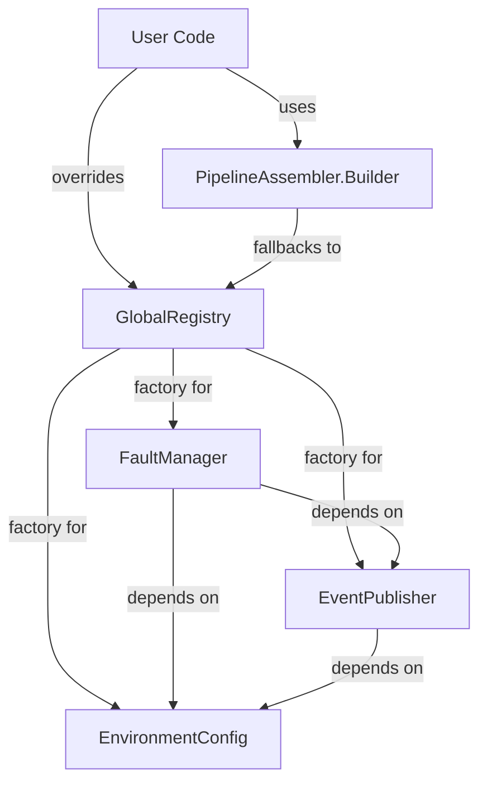

# Requirements

### Overview & Goals
The goal is to provide a central `GlobalRegistry` that manages singleton instances of core components like `EnvironmentConfig`, `EventPublisher`, and `FaultManager`. This allows for a clean way to share these components across the library while still allowing users to override them for customization or testing purposes.

### Scope
- **In Scope**:
    - Implementation of `GlobalRegistry` in `core`.
    - Updates to `EnvironmentConfig` to support subclassing.
    - Integration of `GlobalRegistry` into `PipelineAssembler.Builder` and `SerializationStrategyResolver`.
    - Fixing existing bugs in `GlobalRegistry.kt`.
- **Out of Scope**:
    - Introduction of heavy DI frameworks like Dagger or Koin.
    - Modification of all core class constructors to use the registry (keeping explicit injection as preferred by the user).

# Technical Design

### Current Implementation
- `GlobalRegistry` is currently a draft with a recursive bug in `eventBridgePublisher()` and no support for overriding most components.
- Core classes like `PipelineAssembler` require manual injection of dependencies, which leads to boilerplate code in user applications.
- `EnvironmentConfig` is a final class, making it hard to mock or extend for alternative configuration sources.

### Key Decisions
- **Static Registry (Object)**: A Kotlin `object` will be used to provide a simple, global access point.
- **Lazy Initialization**: Components will be initialized only when first requested.
- **Explicit Manual Updates**: If a dependency (like `EnvironmentConfig`) is overridden, dependent singletons (like `FaultManager`) already created will keep their old reference. Users can call `reset()` or explicitly override them as well.
- **Decoupled Core**: Core class constructors will NOT depend on `GlobalRegistry`. Builders and factories will handle fetching defaults from the registry.

### Proposed Changes
- **GlobalRegistry.kt**:
    - Use `@Volatile` private backing fields for `_envConfig`, `_eventPublisher`, and `_faultManager`.
    - Provide thread-safe getters: `envConfig()`, `eventPublisher()`, and `faultManager()`.
    - `eventPublisher()` will return `EventBridgePublisher` as the default implementation.
    - Provide `set*` methods for all three components to allow runtime overrides.
    - Provide `reset()` to clear all cached instances.
- **EnvironmentConfig.kt**:
    - Change `class EnvironmentConfig` to `open class EnvironmentConfig`.
    - Change all public methods to `open`.
- **PipelineAssembler.kt**:
    - Update `Builder` to use `GlobalRegistry.envConfig()` as the default value for `envConfig`.
    - Update `build()` to fetch `GlobalRegistry.faultManager()` if `faultManager` is still null.
- **SerializationStrategyResolver.kt**:
    - Update default constructor parameter for `envConfig` to use `GlobalRegistry.envConfig()`.

### Architecture Diagram

# Testing

### Validation Approach
Verification will be done through unit tests in the `core` module.

### Key Scenarios
- **Default Lazy Load**: Calling `GlobalRegistry.envConfig()` for the first time should return a default instance, and subsequent calls should return the same instance.
- **Component Override**: Calling `GlobalRegistry.setEnvConfig(custom)` should cause subsequent calls to `GlobalRegistry.envConfig()` to return `custom`.
- **Registry Reset**: Calling `reset()` should clear all cached instances, and next calls should return fresh defaults.
- **Builder Integration**: `PipelineAssembler.Builder().build()` should successfully create an assembler using registry defaults without manual configuration.

### Edge Cases
- **Concurrent Access**: Ensure that multiple threads calling a getter for the first time don't cause multiple initializations (handled by `@Volatile` and double-check locking if necessary, or just simple `synchronized` if performance is not critical).
- **Circular Dependencies**: Ensure `GlobalRegistry` doesn't have circular calls during initialization (e.g. `faultManager` -> `eventPublisher` -> `envConfig` is a safe linear chain).

# Delivery Steps

### ✓ Step 1: Implement core GlobalRegistry logic
Update `GlobalRegistry.kt` to implement a robust singleton pattern with overrides and fix the recursive bug.
- Fix the recursive call in `eventBridgePublisher()`.
- Implement lazy initialization for `envConfig`, `eventPublisher`, and `faultManager` using thread-safe backing fields.
- Add `set*` methods for all three components to allow runtime overrides.
- Add a `reset()` method to clear the registry state.

### ✓ Step 2: Make EnvironmentConfig overridable
Make `EnvironmentConfig` overridable by making the class and its methods `open`.
- Add the `open` keyword to `EnvironmentConfig` class.
- Add the `open` keyword to all public methods in `EnvironmentConfig`.

### ✓ Step 3: Integrate GlobalRegistry into core components and builders
Update `PipelineAssembler.Builder` and other potential locations to use `GlobalRegistry` as the source for default instances.
- Change `PipelineAssembler.Builder.envConfig` default value to `GlobalRegistry.envConfig()`.
- Change `PipelineAssembler.Builder.faultManager` to fallback to `GlobalRegistry.faultManager()` in the `build()` method if not provided.
- Update `SerializationStrategyResolver` to use `GlobalRegistry.envConfig()` as its default dependency.

### ✓ Step 4: Validate Registry behavior with tests
Add unit tests to verify the `GlobalRegistry` functionality.
- Verify that default instances are created lazily.
- Verify that overriding a component works and the new instance is returned by the registry.
- Verify that `reset()` clears the state and causes re-initialization of defaults.
- Verify that `FaultManager` created via the registry uses the registered `EnvironmentConfig` and `EventPublisher`.