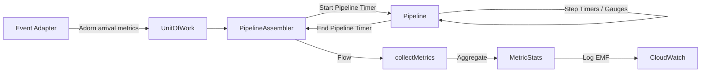

# Requirements

### Overview & Goals
Migrate the metrics collection and reporting system from the TypeScript reference implementation to Kotlin. This will provide standardized performance monitoring, business metrics tracking, and AWS CloudWatch integration for Kotlin-based Lambda stream processing pipelines.

### Scope
- **In Scope**:
    - Migration of `Timer` and `PipelineMetrics` logic.
    - Aggregation of metrics across batches (min, max, average, etc.).
    - AWS CloudWatch Embedded Metric Format (EMF) support.
    - Integration with existing `UnitOfWork` and `PipelineAssembler` abstractions.
    - Support for standard event adapters (Kinesis, DynamoDB, SQS, etc.).
- **Out of Scope**:
    - Direct integration with X-Ray (can be added later as a separate extension).
    - Metrics for non-stream Lambda triggers.

### Functional Requirements
- **Checkpoint Timing**: Track time deltas between pipeline stages and steps.
- **Business Gauges**: Allow recording numeric values (e.g., price, quantity) during processing.
- **Batch Aggregation**: Automatically calculate statistics for all metrics at the end of a Lambda invocation.
- **Pipeline Utilization**: Measure the percentage of records that successfully complete the pipeline.
- **Structured Logging**: Output metrics in AWS EMF format for automatic ingestion by CloudWatch.

# Technical Design

### Current Implementation
The TypeScript reference uses a `PipelineMetrics` object attached to each `UnitOfWork`. Metrics are aggregated at the end of the stream using a `calculateMetrics` function and logged via a middleware or wrapper (`toPromise`).

### Proposed Changes

#### Data Models
- **`Timer`**: A lightweight class using `System.currentTimeMillis()` to record named checkpoints.
- **`PipelineMetrics`**: A container for a `Timer` and a map of gauges (lists of numeric values).
- **`MetricStats`**: A data class for aggregated results:
  ```kotlin
  data class MetricStats(
      val average: Double,
      val min: Double,
      val max: Double,
      val sum: Double,
      val count: Int
  )
  ```

#### Integration with `UnitOfWork`
Metrics will be stored in the `extensions` map of `UnitOfWork`:
```kotlin
fun UnitOfWork.withMetrics(metrics: PipelineMetrics): UnitOfWork = 
    this.withExtension(metrics)

val UnitOfWork.metrics: PipelineMetrics? 
    get() = this.getExtension<PipelineMetrics>()
```

#### Pipeline Assembler Updates
The `PipelineAssembler` currently has a bug where `onEach` is used for `startPipeline` and `endPipeline` hooks, preventing them from modifying the immutable `UnitOfWork`. This will be changed to `map`:
```kotlin
// PipelineAssembler.assemble
.map { uow -> startPipeline(uow) }
// ...
.map { uow -> endPipeline(uow) }
```
Default implementations will be added to track `stream.pipeline.time` and `stream.channel.wait.time`.

#### Architecture Diagram


### File Structure
- `core/src/main/kotlin/io/github/huherto/awsLambdaStream/metrics/`
    - `Timer.kt`: Checkpoint tracking.
    - `PipelineMetrics.kt`: Metrics container.
    - `MetricStats.kt`: Aggregated model.
    - `CalculateMetrics.kt`: Batch aggregation logic.
    - `EmfReporter.kt`: AWS EMF formatting and logging.
    - `MetricsExtensions.kt`: `UnitOfWork` and `Flow` extensions.

# Testing

### Validation Approach
Verification will focus on the accuracy of time tracking and aggregation, as well as the correctness of the EMF output format.

### Key Scenarios
- **Timer Accuracy**: Verify that `Timer.checkpoint` correctly records the time delta from the last checkpoint.
- **Batch Aggregation**: Verify that `calculateMetrics` correctly computes average, min, max, and sum for a batch containing mixed metrics.
- **Pipeline Hooks**: Verify that `PipelineAssembler` correctly records pipeline-level metrics using the `startPipeline`/`endPipeline` hooks.
- **EMF Formatting**: Verify that the generated JSON matches the AWS CloudWatch EMF specification.

### Test Changes
- New unit tests for `Timer`, `CalculateMetrics`, and `EmfReporter`.
- Update `PipelineAssemblerTest` to verify metrics integration.
- Add mock adapter tests to verify arrival time metrics.

# Delivery Steps

### ✓ Step 1: Implement core metrics data models and UnitOfWork extensions
Define the core data structures for metrics in Kotlin.
- Create `Timer` class to track time checkpoints and deltas.
- Create `PipelineMetrics` class to manage timers and gauges for a unit of work.
- Create `MetricStats` data class to represent aggregated statistics (min, max, average, sum, count).
- Define `UnitOfWork` extension functions to store and retrieve `PipelineMetrics` in the `extensions` map.

### ✓ Step 2: Implement metrics aggregation logic
Implement the logic to aggregate metrics from a batch of processed units of work.
- Create `CalculateMetrics` utility to process `List<UnitOfWork>` and produce a map of `MetricStats`.
- Implement stats calculation logic (min, max, avg, sum, count) for both timers and gauges.
- Include calculation for pipeline utilization metrics.
- Add unit tests for `calculateStats` and `Timer` logic using Kotest.

### ✓ Step 3: Implement EMF reporting and logging
Implement the AWS Embedded Metric Format (EMF) reporter for CloudWatch integration.
- Create `EmfReporter` to format aggregated `MetricStats` into the standard EMF JSON structure.
- Support dimensions like `functionname`, `pipeline`, `step`, `stage`, `region`, and `account`.
- Use `EnvironmentConfig` and `envTags` to populate standard dimensions.
- Implement logging logic that respects environment configuration (e.g., `METRICS=emf`).

### ✓ Step 4: Integrate metrics with PipelineAssembler and Adapters
Integrate metrics into the pipeline execution flow.
- Update `PipelineAssembler` to correctly propagate `UnitOfWork` changes from `startPipeline` and `endPipeline` hooks (changing `onEach` to `map`).
- Implement default metrics tracking in `PipelineAssembler` for pipeline start/end and channel wait times.
- Add metrics initialization logic to event adapters (e.g., `KinesisAdapter`, `DynamodbAdapter`) to capture arrival timestamps and batch sizes.
- Create a `Flow<UnitOfWork>.collectMetrics()` extension to simplify final aggregation and reporting in Lambda handlers.