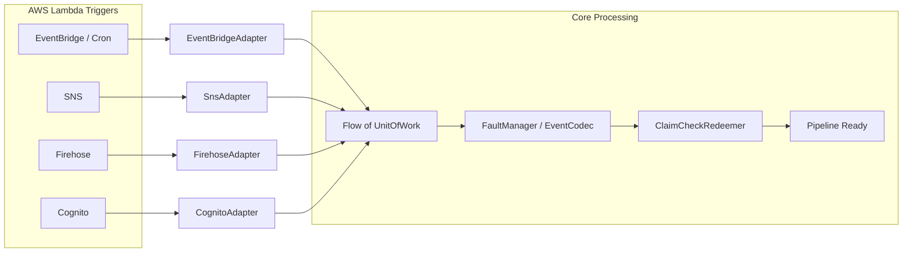

# Requirements

### Overview & Goals
The goal of this task is to continue the migration of the `aws-lambda-stream` framework from TypeScript to Kotlin. Following the user's priority, we will focus on completing the **Event Source Adapters** (the `from` package) to ensure that the Kotlin version can consume events from the same variety of AWS services as the original TypeScript version.

### Scope
- **In Scope**:
  - Implementation of missing adapters in `io.github.huherto.awsLambdaStream.from`.
  - Supporting AWS services: EventBridge, SNS, Kinesis Data Firehose, Cognito, and Scheduled Events (Cron).
  - Providing test helpers to create mock events for integration testing.
  - Ensuring consistency with existing Kotlin adapters (DynamoDB, SQS, Kinesis, S3).
- **Out of Scope**:
  - Implementation of missing Sinks or Connectors (to be addressed in a subsequent plan).
  - Migration of Metrics or Resilience flavors (to be addressed in a subsequent plan).

### Functional Requirements
- Each adapter must convert a native AWS Lambda event object into a `Flow<UnitOfWork>`.
- Use `EventCodec` to decode record payloads into structured `Event` objects.
- Integrate with `FaultManager` to handle and record decoding errors without breaking the stream.
- Preserve event metadata (IDs, timestamps, sequence numbers) in the `UnitOfWork`.
- Support `ClaimCheckRedeemer` for adapters where it makes sense (following the pattern in `SqsAdapter` and `KinesisAdapter`).

# Technical Design

### Current Implementation
The framework currently has a robust Kotlin core with the following adapters already migrated:
- `DynamodbAdapter.kt`
- `KinesisAdapter.kt`
- `S3Adapter.kt`
- `SqsAdapter.kt`

These adapters use Kotlin Coroutines `Flow` to process event records and `UnitOfWork` as the primary data structure for the pipeline.

### Proposed Changes
We will implement the following new adapters in the `from` package:
- **`EventBridgeAdapter.kt`**: Maps `ScheduledEvent` and `CloudWatchEvent`. The `detail` field is treated as the primary event payload.
- **`SnsAdapter.kt`**: Maps `SNSEvent.Records`. The `Sns.Message` is treated as the payload.
- **`FirehoseAdapter.kt`**: Maps `KinesisFirehoseEvent.records`. It includes base64 decoding of the `data` field and tracking of the `recordId` for transformation responses.
- **`CognitoAdapter.kt`**: Maps various Cognito trigger events.

### Architecture Diagram

### File Structure
- `core/src/main/kotlin/io/github/huherto/awsLambdaStream/from/`
  - `EventBridgeAdapter.kt` (New)
  - `SnsAdapter.kt` (New)
  - `FirehoseAdapter.kt` (New)
  - `CognitoAdapter.kt` (New)
  - `CronAdapter.kt` (New - might be combined with EventBridge)

# Testing

### Validation Approach
Verification will be performed through unit tests for each new adapter, comparing the resulting `UnitOfWork` flow against expected values from sample AWS events.

### Key Scenarios
- **Payload Decoding**: Verify that `EventCodec` correctly deserializes JSON payloads from EventBridge, SNS, and Firehose.
- **Metadata Mapping**: Ensure `eventId`, `messageId`, `timestamp`, and other metadata are correctly populated in `UnitOfWork`.
- **Fault Handling**: Simulate malformed JSON payloads and verify that `FaultManager` captures the error and the stream continues.
- **Empty Events**: Ensure adapters gracefully handle empty record lists by returning an `emptyFlow()`.
- **Firehose Base64**: Specifically verify that Firehose records are correctly base64-decoded before being passed to the codec.

# Delivery Steps

### ✓ Step 1: Implement EventBridge and Cron Adapters
### Stage 1: Implement EventBridge and Cron Adapters
EventBridge events (standard and scheduled) can be consumed by the framework pipelines.

- Create `EventBridgeAdapter.kt` in the `from` package.
- Implement `fromEventBridge` to handle custom EventBridge events.
- Implement `fromScheduledEvent` to handle Cron/Rate scheduled events.
- Add test factory methods for generating mock EventBridge and Scheduled events.

### ✓ Step 2: Implement SNS Adapter
### Stage 2: Implement SNS Adapter
SNS notifications can be consumed as a flow of UnitOfWork.

- Create `SnsAdapter.kt` in the `from` package.
- Implement `fromSns` for raw message handling and `fromSnsEvent` for full SNS event handling.
- Ensure `UnitOfWork` correctly captures SNS metadata (MessageId, Subject, Attributes).
- Add test factory methods for generating mock SNS events.

### ✓ Step 3: Implement Kinesis Firehose Adapter
### Stage 3: Implement Kinesis Firehose Adapter
Kinesis Data Firehose transformation events are supported.

- Create `FirehoseAdapter.kt` in the `from` package.
- Implement `fromFirehose` to handle `KinesisFirehoseEvent`.
- Support base64 decoding of the `data` field into the `event` payload.
- Map Firehose-specific fields (recordId, approximateArrivalTimestamp) into the `UnitOfWork`.

### ✓ Step 4: Implement Cognito and minor Adapters
### Stage 4: Implement Cognito and remaining minor Adapters
Remaining AWS trigger events are supported by the framework.

- Create `CognitoAdapter.kt` for Cognito trigger events (e.g., PostConfirmation, PreSignup).
- Implement `CwAdapter` for CloudWatch Logs or Alarms if needed based on the TypeScript reference.
- Verify all adapters follow the `FaultManager` and `EventCodec` patterns.