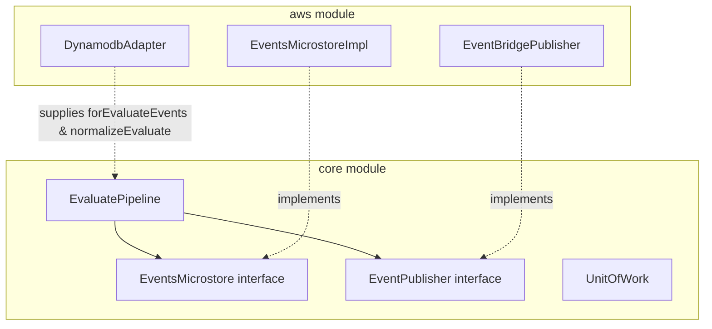

# Requirements

### Overview & Goals
Move the `EvaluatePipeline` class from the `aws` module (`io.kopipes.aws.flavors`) to the `core` module (`io.kopipes.core.flavors`). This will decouple event evaluation and higher-order event emission from AWS-specific record formats (such as DynamoDB streams), allowing `EvaluatePipeline` to be used in generic, non-AWS environments or with custom event stores while preserving full compatibility with AWS Lambda streams via adapter functions.

### Scope
- **In Scope**:
  - Create `io.kopipes.core.flavors.EvaluatePipeline` in `core` module.
  - Decouple stream record inspection and unmarshalling by providing pluggable `isEvaluateEvent` and `normalizer` lambdas with sensible generic defaults (following the pattern established by `CorrelatePipeline`).
  - Add AWS DynamoDB adapter helpers in `io.kopipes.aws.from.DynamodbAdapter` (`forEvaluateEvents` and `normalizeEvaluate`).
  - Remove `aws/src/main/kotlin/io/kopipes/aws/flavors/EvaluatePipeline.kt`.
  - Update `core` unit tests (`EvaluatePipelineTest`) and `aws` integration/unit tests.
  - Update example applications (`sut-control-service`, `urls-control-service`) and documentation references.
- **Out of Scope**:
  - Modifying other pipeline flavors (`CdcPipeline`, `MaterializePipeline`, etc.).
  - Changing the evaluation or higher-order event emission business semantics (`emit`, `expression`, tag aggregation, triggers copying).

### User Stories
- As a developer using the `core` library, I want to use `EvaluatePipeline` to correlate and evaluate stream events to produce higher-order events without pulling in AWS SDK dependencies.
- As a developer using AWS DynamoDB stream triggers, I want `DynamodbAdapter` to supply the evaluate-specific event filtering and record unmarshalling logic cleanly to `EvaluatePipeline`.

### Functional Requirements
- `EvaluatePipeline` must reside in package `io.kopipes.core.flavors`.
- `EvaluatePipeline` must not import any classes from `com.amazonaws.*` or `io.kopipes.aws.*`.
- `EvaluatePipeline` must accept:
  - `isEvaluateEvent: ((UnitOfWork) -> Boolean)?` (default: checks `uow.event != null`)
  - `normalizer: ((UnitOfWork) -> UnitOfWork)?` (default: returns `uow`)
  - `expression: ((UnitOfWork) -> Boolean)?`
  - `emit: ((UnitOfWork) -> List<Event>)?`
  - `eventsMicrostore: EventsMicrostore`
  - `eventPublisher: EventPublisher`
  - `correlationKeySuffix: String`
  - `index: String?`
  - `bufferCapacity: Int`
  - `eventCodec: EventCodec?`
- `DynamodbAdapter` in `:aws` must provide companion/static methods `forEvaluateEvents` and `normalizeEvaluate` to handle `DynamodbEvent.DynamodbStreamRecord`, `RecordPair`, and `TableChangeEvent`.
- Higher-order event creation (`toHigherOrderEvents`) must continue to aggregate tags (omitting `region` and `source`), map triggers, set metadata (`eventId`, `partitionKey`), and emit events to `eventPublisher`.

### Non-Functional Requirements
- Maintain backward compatibility for Kotlin and Java consumers via `Builder` methods (`expressionJava`, `emitJava`, `onContentType`).
- Zero new runtime dependencies added to `:core`.
- Full unit test coverage in both `:core` and `:aws`.

# Technical Design

### Current Implementation
- `EvaluatePipeline` currently lives in `aws/src/main/kotlin/io/kopipes/aws/flavors/EvaluatePipeline.kt`.
- It directly references `DynamodbEvent.DynamodbStreamRecord`, `RecordImage`, `RecordPair`, and `TableChangeEvent` in its `forEvents` and `normalize` methods.
- Other pipelines like `CorrelatePipeline` already live in `core/src/main/kotlin/io/kopipes/core/flavors/CorrelatePipeline.kt` and use pluggable `isCollectedEvent` and `normalizer` lambdas, while `DynamodbAdapter` in `:aws` provides AWS-specific adapter functions (`forCollectedEvents`, `normalize`).

### Key Decisions
- **Decoupling Strategy**: Follow the `CorrelatePipeline` pattern by introducing `isEvaluateEvent: ((UnitOfWork) -> Boolean)?` and `normalizer: ((UnitOfWork) -> UnitOfWork)?` to `EvaluatePipeline`. Default `forEvents` checks `uow.event != null` when no predicate is provided.
- **AWS Helpers**: Move the DynamoDB-specific record checking and image extraction to `DynamodbAdapter.forEvaluateEvents` and `DynamodbAdapter.normalizeEvaluate`.
- **Publisher & Microstore**: Keep `EventPublisher` and `EventsMicrostore` interfaces from `io.kopipes.core.sinks`, which are already in `:core`.

### Proposed Changes

#### 1. `core/src/main/kotlin/io/kopipes/core/flavors/EvaluatePipeline.kt`
Define `EvaluatePipeline` in `core` with:
- Constructor parameters:
  - `id: String`
  - `val eventPublisher: EventPublisher`
  - `val eventsMicrostore: EventsMicrostore`
  - `val onContentType: (UnitOfWork) -> Boolean = { true }`
  - `val eventFilter: EventFilter = EventFilter.Any`
  - `val correlationKeySuffix: String = ""`
  - `val index: String? = null`
  - `val bufferCapacity: Int = Channel.BUFFERED`
  - `val eventCodec: EventCodec? = null`
  - `val expression: ((UnitOfWork) -> Boolean)? = null`
  - `val emit: ((UnitOfWork) -> List<Event>)? = null`
  - `val isEvaluateEvent: ((UnitOfWork) -> Boolean)? = null`
  - `val normalizer: ((UnitOfWork) -> UnitOfWork)? = null`
- Filtering and Normalization:
  ```kotlin
  fun forEvents(uow: UnitOfWork): Boolean {
      if (isEvaluateEvent != null) return isEvaluateEvent.invoke(uow)
      return uow.event != null
  }

  fun normalize(uow: UnitOfWork): UnitOfWork {
      if (normalizer != null) return normalizer.invoke(uow)
      return uow
  }
  ```
- Correlated queries, expression evaluation, higher order events emission, and publishing flow.
- Companion object builder with Java compatibility helpers.

#### 2. `aws/src/main/kotlin/io/kopipes/aws/from/DynamodbAdapter.kt`
Add companion methods:
- `forEvaluateEvents(uow: UnitOfWork): Boolean`:
  Inspects `DynamodbEvent.DynamodbStreamRecord` for `INSERT` with `sk == "EVENT"` or `discriminator == "CORREL"`.
- `normalizeEvaluate(pipelineId: String, index: String? = null, eventCodec: EventCodec): (UnitOfWork) -> UnitOfWork`:
  Unmarshalls `RecordImage` from `TableChangeEvent.raw` (or `uow.event.raw`), populates `QueryParams` (pk, correlation, data, index), and sets `meta` (`eventId`, `partitionKey`).

#### 3. Consumers and Documentation
- Delete `aws/src/main/kotlin/io/kopipes/aws/flavors/EvaluatePipeline.kt`.
- Update imports in:
  - `examples/sut/sut-control-service/app/src/main/kotlin/org/myorg/sut/TriggerContainer.kt`
  - `examples/urlshortener/urls-control-service/app/src/main/java/org/myorg/urls/ControlTriggerContainer.java`
  - `docs/EventImplementationKotlin.md`
  - `docs/EventImplementationJava.md`
  - `docs/JavaDevelopers.md`

### Architecture Diagram


### File Structure
- **Added**:
  - `core/src/main/kotlin/io/kopipes/core/flavors/EvaluatePipeline.kt`
  - `core/src/test/kotlin/io/kopipes/core/flavors/EvaluatePipelineTest.kt`
- **Modified**:
  - `aws/src/main/kotlin/io/kopipes/aws/from/DynamodbAdapter.kt`
  - `aws/src/test/kotlin/io/kopipes/aws/flavors/EvaluatePipelineTest.kt`
  - `examples/sut/sut-control-service/app/src/main/kotlin/org/myorg/sut/TriggerContainer.kt`
  - `examples/urlshortener/urls-control-service/app/src/main/java/org/myorg/urls/ControlTriggerContainer.java`
  - `docs/EventImplementationKotlin.md`
  - `docs/EventImplementationJava.md`
  - `docs/JavaDevelopers.md`
- **Deleted**:
  - `aws/src/main/kotlin/io/kopipes/aws/flavors/EvaluatePipeline.kt`

# Testing

### Validation Approach
- Verify `:core` module builds independently with no AWS dependencies.
- Unit test `EvaluatePipeline` in `:core` using pure in-memory test doubles (`EventsMicrostoreInMemory`, `EventPublisherInMemory`).
- Unit test `DynamodbAdapter.forEvaluateEvents` and `DynamodbAdapter.normalizeEvaluate` in `:aws`.
- Integration/unit test `EvaluatePipeline` in `:aws` using DynamoDB stream records and mocked AWS sinks.
- Verify examples (`sut-control-service`, `urls-control-service`) compile and pass tests.

### Key Scenarios
1. **Core Pipeline Flow**: Event arrives in flow -> `forEvents` validates -> `normalize` runs -> `filterEvents` filters -> `queryCorrelated` fetches correlated events -> `expression` evaluates -> `emit` creates higher order events -> `publish` publishes to `eventPublisher`.
2. **AWS DynamoDB Stream Flow**: `DynamodbEvent.DynamodbStreamRecord` with `EVENT` or `CORREL` discriminator -> `DynamodbAdapter.forEvaluateEvents` accepts -> `DynamodbAdapter.normalizeEvaluate` extracts JSON payload & metadata -> `EvaluatePipeline` processes and emits higher-order events.
3. **Expression Filtering**: When `expression` returns false, no higher-order events are emitted and flow completes.
4. **Tag Aggregation and Trigger Lineage**: Higher order event receives merged tags (with `region` and `source` removed) and trigger references matching upstream events.

### Edge Cases
- Missing or null `expression` (defaults to triggering on incoming event).
- Missing or null `emit` (emits empty list).
- Suffix mismatch on correlation key (filtered out during complex evaluation).
- Malformed or missing event payload during normalization.

# Delivery Steps

### ✓ Step 1: Implement EvaluatePipeline in core module
`EvaluatePipeline` and its builder are defined in `core/src/main/kotlin/io/kopipes/core/flavors/EvaluatePipeline.kt` with no AWS dependencies.

- Create `core/src/main/kotlin/io/kopipes/core/flavors/EvaluatePipeline.kt` in package `io.kopipes.core.flavors`.
- Implement `EvaluatePipeline` with support for pluggable `isEvaluateEvent` filter and `normalizer` function (with defaults).
- Implement `EvaluatePipeline.Builder` supporting Kotlin and Java builder methods (`expressionJava`, `emitJava`, `onContentType`, `normalizer`, etc.).
- Add unit tests in `core/src/test/kotlin/io/kopipes/core/flavors/EvaluatePipelineTest.kt` covering core pipeline logic with in-memory stores and mock/stub codecs.

### ✓ Step 2: Add DynamoDB evaluate adapter helpers in aws module
`DynamodbAdapter` provides DynamoDB-specific predicate and normalization functions for evaluate stream records.

- Add `forEvaluateEvents(uow: UnitOfWork): Boolean` in `DynamodbAdapter` to filter DynamoDB `EVENT` and `CORREL` records.
- Add `normalizeEvaluate(pipelineId: String, index: String? = null, eventCodec: EventCodec): (UnitOfWork) -> UnitOfWork` in `DynamodbAdapter` to extract `RecordPair`, `QueryParams`, partition key, and decode events.
- Update `aws/src/test/kotlin/io/kopipes/aws/flavors/EvaluatePipelineTest.kt` to use the `DynamodbAdapter` helpers with `EvaluatePipeline`.
- Remove `aws/src/main/kotlin/io/kopipes/aws/flavors/EvaluatePipeline.kt`.

### ✓ Step 3: Update consumers, examples, and documentation
All example applications, tests, and documentation reflect the new `io.kopipes.core.flavors.EvaluatePipeline` package.

- Update imports and builder invocations in `examples/sut/sut-control-service/app/src/main/kotlin/org/myorg/sut/TriggerContainer.kt`.
- Update imports and builder invocations in `examples/urlshortener/urls-control-service/app/src/main/java/org/myorg/urls/ControlTriggerContainer.java`.
- Update package references in documentation (`docs/EventImplementationKotlin.md`, `docs/EventImplementationJava.md`, `docs/JavaDevelopers.md`).
- Run `./gradlew test` to verify full compilation and test pass across all modules.