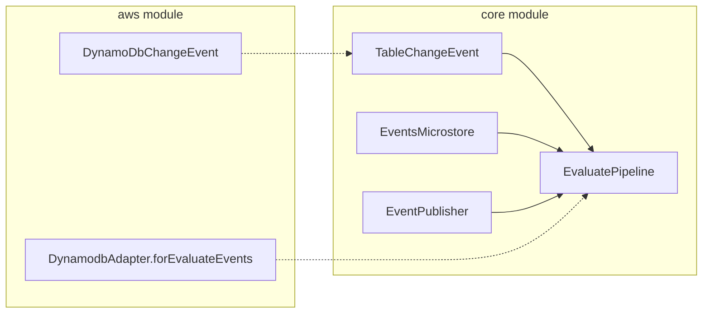

# Requirements

### Overview & Goals
Move `EvaluatePipeline` from the `aws` module (`io.kopipes.aws.flavors`) to the `core` module (`io.kopipes.core.flavors`).
Now that `TableChangeEvent` has been extracted to `core`, `EvaluatePipeline` can be completely decoupled from AWS DynamoDB stream classes (`DynamodbEvent.DynamodbStreamRecord`), following the same pattern as `CollectPipeline` and `CorrelatePipeline`.

### Scope
- **In Scope:**
  - Move `EvaluatePipeline` and its `Builder` to `core/src/main/kotlin/io/kopipes/core/flavors/EvaluatePipeline.kt`.
  - Decouple `EvaluatePipeline` from `DynamodbEvent` by using `TableChangeEvent` and a customizable `isEvaluateEvent` predicate (similar to `CorrelatePipeline.isCollectedEvent`).
  - Add `DynamodbAdapter.forEvaluateEvents(uow: UnitOfWork)` in `aws` for DynamoDB stream event filtering.
  - Add comprehensive unit tests in `core` module (`core/src/test/kotlin/io/kopipes/core/flavors/EvaluatePipelineTest.kt`).
  - Update AWS test suite and example projects (`sut-control-service`, `urls-control-service`) to use the new `core` package.
- **Out of Scope:**
  - Changes to other pipeline flavors (`UpdatePipeline`, `CdcPipeline`).
  - Changes to `EventsMicrostore` or `EventPublisher` contracts.

### User Stories
- As a framework user, I want `EvaluatePipeline` to live in `core` so that I can evaluate and aggregate events regardless of the underlying cloud provider or transport.

### Functional Requirements
1. `EvaluatePipeline` must reside in package `io.kopipes.core.flavors`.
2. `EvaluatePipeline` must not depend on any AWS SDK classes or `aws` module dependencies.
3. `forEvents` filtering in `EvaluatePipeline` must support custom predicates (`isEvaluateEvent`) and default to checking `TableChangeEvent` / `Event` validity.
4. `DynamodbAdapter` must provide `forEvaluateEvents` helper for DynamoDB stream event detection (INSERT sk=EVENT or discriminator=CORREL).
5. Higher-order event creation (`toHigherOrderEvents`), correlation queries (`complex`), tag aggregation, and publishing semantics must remain identical.

### Non-Functional Requirements
- Maintain backward compatibility of `EvaluatePipeline.Builder` methods.
- Kotlin coroutines / Flow idioms used consistently.
- All unit tests must pass via `./gradlew test`.

# Technical Design

### Current Implementation
`EvaluatePipeline` currently lives in `aws/src/main/kotlin/io/kopipes/aws/flavors/EvaluatePipeline.kt`.
It imports `com.amazonaws.services.lambda.runtime.events.DynamodbEvent` solely for `forEvents(uow: UnitOfWork)` which inspects `uow.record as? DynamodbEvent.DynamodbStreamRecord`.
The rest of `EvaluatePipeline` (such as `normalize`, `complex`, `toHigherOrderEvents`) already interacts exclusively with `core` interfaces (`TableChangeEvent`, `EventsMicrostore`, `EventPublisher`, `EventCodec`, `FaultManager`).

### Key Decisions
1. **Decouple event filtering via `isEvaluateEvent` predicate**:
   - Provide an optional `isEvaluateEvent: ((UnitOfWork) -> Boolean)?` in `EvaluatePipeline`, defaulting to checking if `uow.event` is a valid `TableChangeEvent` (non-deleted, with correlation or event content) or non-null `Event`.
   - Add `DynamodbAdapter.forEvaluateEvents(uow)` in `aws` module so AWS stream handlers can easily pass the DynamoDB record filter, matching the pattern established in `CorrelatePipeline` / `DynamodbAdapter.forCollectedEvents`.
2. **Move class directly to `core.flavors`**:
   - Delete `aws/src/main/kotlin/io/kopipes/aws/flavors/EvaluatePipeline.kt` and create `core/src/main/kotlin/io/kopipes/core/flavors/EvaluatePipeline.kt`.
   - Update imports in example apps to `io.kopipes.core.flavors.EvaluatePipeline`.

### Architecture Diagram

### Proposed Changes
1. **`core/src/main/kotlin/io/kopipes/core/flavors/EvaluatePipeline.kt`**:
   - Package: `io.kopipes.core.flavors`.
   - Remove `DynamodbEvent` import.
   - Add `isEvaluateEvent` property and builder setter.
   - Refactor `forEvents` to use `isEvaluateEvent?.invoke(uow)` or default `TableChangeEvent` check.
   - Keep `normalize`, `complex`, `toHigherOrderEvents`, `aggregateTags`, `publish`, `connect`, and `Builder`.
2. **`aws/src/main/kotlin/io/kopipes/aws/from/DynamodbAdapter.kt`**:
   - Add `@JvmStatic fun forEvaluateEvents(uow: UnitOfWork): Boolean` in `companion object`.
3. **`aws/src/main/kotlin/io/kopipes/aws/flavors/EvaluatePipeline.kt`**:
   - Removed.
4. **Examples & Test usages**:
   - Update `TriggerContainer.kt` and `ControlTriggerContainer.java` imports.

### File Structure
- `core/src/main/kotlin/io/kopipes/core/flavors/EvaluatePipeline.kt` (New)
- `core/src/test/kotlin/io/kopipes/core/flavors/EvaluatePipelineTest.kt` (New)
- `aws/src/main/kotlin/io/kopipes/aws/flavors/EvaluatePipeline.kt` (Deleted)
- `aws/src/main/kotlin/io/kopipes/aws/from/DynamodbAdapter.kt` (Modified)
- `aws/src/test/kotlin/io/kopipes/aws/flavors/EvaluatePipelineTest.kt` (Modified)
- `examples/sut/sut-control-service/app/src/main/kotlin/org/myorg/sut/TriggerContainer.kt` (Modified)
- `examples/urlshortener/urls-control-service/app/src/main/java/org/myorg/urls/ControlTriggerContainer.java` (Modified)

# Testing

### Validation Approach
Verify behavior through unit tests in both `core` and `aws` modules using Kotest assertions and JUnit 5 in Arrange-Act-Assert style.

### Key Scenarios
1. **Core Pipeline Execution**:
   - Verify `EvaluatePipeline` normalization converts `TableChangeEvent` to parsed `Event` with correct metadata (`eventId`, `partitionKey`, `QueryParams`).
   - Verify `complex` flow without expression directly passes triggers.
   - Verify `complex` flow with expression queries correlated records from `EventsMicrostore` and filters according to expression predicate.
   - Verify `toHigherOrderEvents` creates higher-order events with aggregated tags (omitting `region` and `source`), correct triggers, ID, and partition key.
   - Verify events are published via `EventPublisher`.
2. **DynamoDB Adapter Helper**:
   - Verify `DynamodbAdapter.forEvaluateEvents` returns `true` for INSERT records with `sk=EVENT` or `discriminator=CORREL`, and `false` otherwise.
3. **AWS Integration**:
   - Verify `EvaluatePipeline` runs end-to-end with `DynamoDbChangeEvent` and `DynamodbAdapter`.

### Edge Cases
- Missing or malformed event payload JSON in `TableChangeEvent`.
- Correlation key suffixes matching and mismatching.
- Expression returning `false` or throwing exception (handled by `FaultManager`).
- Empty emit results or null triggering events.

### Test Changes
- Add `core/src/test/kotlin/io/kopipes/core/flavors/EvaluatePipelineTest.kt` testing core functionality with in-memory test doubles.
- Update `aws/src/test/kotlin/io/kopipes/aws/flavors/EvaluatePipelineTest.kt` to test integration with AWS DynamoDB change events.

# Delivery Steps

### ✓ Step 1: Move EvaluatePipeline to core and decouple from DynamoDB types
Move `EvaluatePipeline` from the `aws` module to `core`, replacing direct AWS `DynamodbEvent` references with generic predicates and `TableChangeEvent`.

- Create `core/src/main/kotlin/io/kopipes/core/flavors/EvaluatePipeline.kt` under package `io.kopipes.core.flavors`.
- Remove AWS SDK imports (`DynamodbEvent`) from `EvaluatePipeline`.
- Support configurable `isEvaluateEvent` predicate (defaulting to checking `uow.event` / `TableChangeEvent`) and optional custom `normalizer` in `EvaluatePipeline.Builder`.
- Ensure standard `normalize`, `complex`, `toHigherOrderEvents`, `aggregateTags`, and `connect` operations operate on core types (`TableChangeEvent`, `EventsMicrostore`, `EventPublisher`, `FaultManager`).
- Remove `aws/src/main/kotlin/io/kopipes/aws/flavors/EvaluatePipeline.kt`.
- Create unit tests in `core/src/test/kotlin/io/kopipes/core/flavors/EvaluatePipelineTest.kt` verifying pipeline flows, normalizer, correlation query, expression evaluation, tag aggregation, and event publishing using core in-memory mocks.

### ✓ Step 2: Add DynamoDB evaluate adapter helpers and update AWS flavor tests
Provide DynamoDB-specific evaluate event matching in `DynamodbAdapter` and update AWS test suites.

- Add `@JvmStatic fun forEvaluateEvents(uow: UnitOfWork): Boolean` to `DynamodbAdapter.Companion` in `aws/src/main/kotlin/io/kopipes/aws/from/DynamodbAdapter.kt`.
- Update `aws/src/test/kotlin/io/kopipes/aws/flavors/EvaluatePipelineTest.kt` to import `io.kopipes.core.flavors.EvaluatePipeline` and test integration with `DynamoDbChangeEvent` and `DynamodbAdapter.forEvaluateEvents`.
- Verify AWS module unit tests pass.

### ✓ Step 3: Update example apps and references to use core EvaluatePipeline
Update example applications and containers referencing `io.kopipes.aws.flavors.EvaluatePipeline` to use the new core package.

- Update `examples/sut/sut-control-service/app/src/main/kotlin/org/myorg/sut/TriggerContainer.kt` import from `io.kopipes.aws.flavors.EvaluatePipeline` to `io.kopipes.core.flavors.EvaluatePipeline`.
- Update `examples/urlshortener/urls-control-service/app/src/main/java/org/myorg/urls/ControlTriggerContainer.java` import from `io.kopipes.aws.flavors.EvaluatePipeline` to `io.kopipes.core.flavors.EvaluatePipeline`.
- Run full test suite across all modules (`./gradlew test`) to verify all builds and tests succeed.