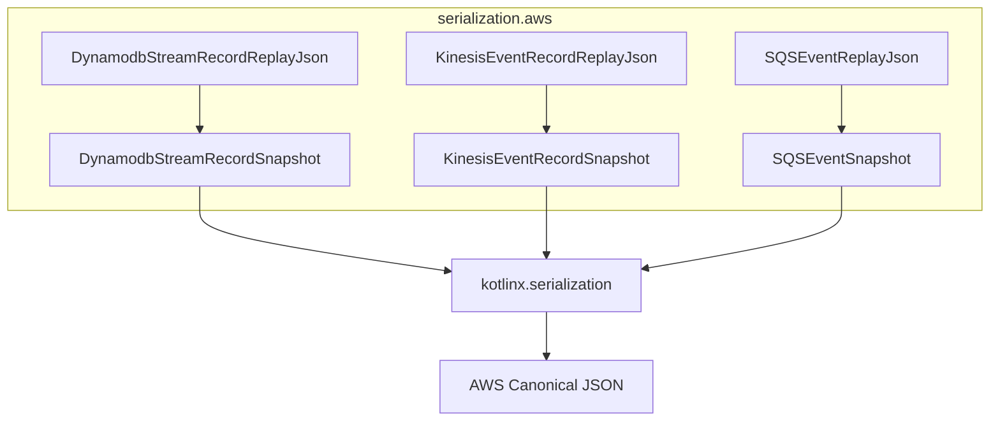

# Requirements

### Overview & Goals
The goal is to remove the `com.amazonaws:aws-lambda-java-serialization` dependency from the project. This dependency is currently used to provide "canonical" AWS serialization for events like Kinesis, SQS, and DynamoDB Streams, which is crucial for consistent replay functionality. We will replace it with Kotlin snapshot classes (DTOs) and `kotlinx.serialization` to achieve the same format while removing the heavy external dependency.

### Scope
- **In Scope**:
    - Creating snapshot DTOs for `KinesisEvent`, `SQSEvent`, and `DynamodbEvent.DynamodbStreamRecord` that mirror the AWS SDK classes.
    - Implementing conversion logic between AWS SDK classes and these snapshots.
    - Replacing `LambdaEventSerializers` usage in `serialization.aws` package with `kotlinx.serialization` and the new snapshots.
    - Removing the dependency from `build.gradle.kts` and `libs.versions.toml`.
- **Out of Scope**:
    - Changing the serialization format for other parts of the system.
    - Replacing `aws-lambda-java-events` or `aws-lambda-java-core`.
    - Modifying domain event serialization logic.

# Technical Design

### Current Implementation
The project uses `com.amazonaws.services.lambda.runtime.serialization.events.LambdaEventSerializers` (from the `aws-lambda-java-serialization` library) to handle JSON serialization of AWS Event classes. This library is used in several `*ReplayJson` objects within `io.github.huherto.awsLambdaStream.serialization.aws`.

### Key Decisions
1. **Snapshot DTOs for AWS Events**: To allow `kotlinx.serialization` to handle Java-based AWS event classes, we will create Kotlin snapshot DTOs that mirror the required fields and structure.
2. **Consistent Replay Format**: The snapshots will use `@SerialName` and custom conversion logic (e.g., Base64 for `ByteBuffer`, Unix timestamps for `Date`) to ensure the emitted JSON matches the AWS canonical format exactly.
3. **Internal Package for Snapshots**: Snapshots will be kept in a subpackage `io.github.huherto.awsLambdaStream.serialization.aws.snapshots` to keep the public API clean while fulfilling internal serialization needs.

### Proposed Changes
- **New Snapshot DTOs**:
    - `KinesisSnapshots.kt`: DTOs for `KinesisEvent` and `KinesisEventRecord`.
    - `SqsSnapshots.kt`: DTOs for `SQSEvent` and `SQSMessage`.
    - `DynamodbSnapshots.kt`: DTOs for `DynamodbStreamRecord`.
- **Modified Replay Utility Objects**:
    - Update `DynamodbStreamRecordReplayJson`, `KinesisEventRecordReplayJson`, `KinesisEventReplayJson`, `SQSEventReplayJson`, and `SQSMessageReplayJson` to use snapshots and `kotlinx.serialization.json.Json`.
- **Dependency Cleanup**:
    - `core/build.gradle.kts`: Remove `libs.aws.java.serial`.
    - `gradle/libs.versions.toml`: Remove `aws-java-serial`.

### Architecture Diagram

# Testing

### Validation Approach
Verification will rely on the existing comprehensive test suite in the `serialization.aws` package, which already checks for round-trip consistency and specific JSON field presence.

### Key Scenarios
- **Kinesis Round-trip**: Ensure `KinesisEventRecord` can be serialized to JSON (with Base64 data) and back to the same object.
- **DynamoDB AttributeValues**: Ensure `DynamodbStreamRecord` preserves the nested `S`, `N`, `BOOL` structure in JSON.
- **SQS Messages**: Ensure `SQSEvent.SQSMessage` is correctly handled.
- **Date Handling**: Verify that timestamps are serialized consistently and can be deserialized back into `java.util.Date`.

### Test Files
- `core/src/test/kotlin/io/github/huherto/awsLambdaStream/serialization/aws/KinesisEventRecordReplayJsonTest.kt`
- `core/src/test/kotlin/io/github/huherto/awsLambdaStream/serialization/aws/DynamodbStreamRecordReplayJsonTest.kt`
- `core/src/test/kotlin/io/github/huherto/awsLambdaStream/serialization/aws/SQSMessageReplayJsonTest.kt`

# Delivery Steps

### ✓ Step 1: Implement snapshot DTOs for AWS Events
Create Kotlin snapshot classes and custom serializers to replicate AWS canonical format.
- Create `core/src/main/kotlin/io/github/huherto/awsLambdaStream/serialization/aws/snapshots/` directory.
- Implement `ByteBufferSerializer` (Base64) and `DateSerializer` (Unix timestamp in seconds).
- Create `KinesisSnapshots.kt`, `SqsSnapshots.kt`, and `DynamodbSnapshots.kt` with `@Serializable` DTOs.
- Implement conversion functions (e.g., `KinesisEventRecord.toSnapshot()`).

### ✓ Step 2: Update *ReplayJson classes to use snapshots and kotlinx.serialization
Refactor existing replay utilities to use the new snapshots and `kotlinx.serialization`.
- Update `DynamodbStreamRecordReplayJson`, `KinesisEventRecordReplayJson`, `KinesisEventReplayJson`, `SQSEventReplayJson`, and `SQSMessageReplayJson`.
- Replace `LambdaEventSerializers` logic with the new snapshot-based serialization.
- Ensure the existing tests for these classes still pass.

### ✓ Step 3: Remove aws-lambda-java-serialization dependency
Remove the `aws-lambda-java-serialization` dependency and verify the build.
- Remove `implementation(libs.aws.java.serial)` from `core/build.gradle.kts`.
- Clean up `gradle/libs.versions.toml` (remove `aws-java-serial`).
- Verify the build completes and all tests pass.