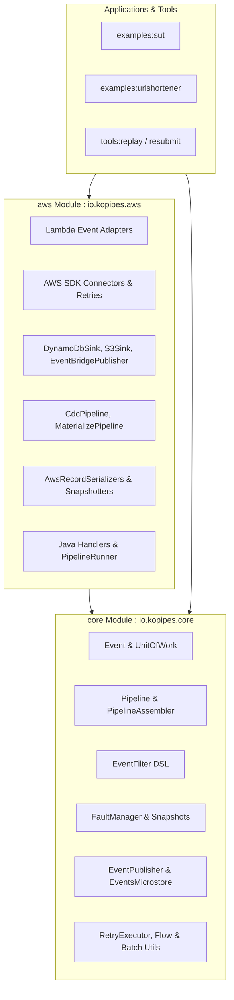

# Requirements

### Overview & Goals
The project provides stream processing abstractions and utilities for event-driven systems. Currently, cloud-agnostic primitives (event models, Flow operators, pipeline builders, fault management contracts, and serialization) and AWS-specific components (AWS SDK v2/Kotlin clients, Lambda stream adapters, DynamoDB/S3/EventBridge sinks, and KMS encryption) reside together in a single `core` module.

The goal is to cleanly decouple the codebase into:
1. **`core`**: A lightweight, cloud-agnostic streaming foundation with **zero AWS SDK dependencies**, maximizing reusability, test execution speed, and architectural clarity.
2. **`aws`**: An integration module that builds upon `core` to provide AWS-specific connectors, adapters, sinks, serializers, and Lambda handlers.

### Scope
- **In Scope**:
  - Restructure project into a two-module layout (`:core` and `:aws`).
  - Namespace core agnostic classes under `io.kopipes.core` (or `io.kopipes`) and AWS components under `io.kopipes.aws`.
  - Eliminate all AWS SDK dependencies from `:core`.
  - Decouple extension points (`FaultManager` retry predicates, `UnitOfWorkSnapshotter` record snapshotters, environment configuration, global registries).
  - Migrate all example applications (`examples/sut/*`, `examples/urlshortener/*`) and CLI tools (`tools/replay-events`, `tools/resubmit-events`).
  - Preserve replay, fault snapshotting, and fault resubmission semantics.
- **Out of Scope**:
  - Adding connectors for non-AWS cloud providers (GCP, Azure) in this iteration.
  - Modifying infrastructure CDK code beyond dependency and package adjustments.

### User Stories
- **As a library consumer**, I want to import `kopipes-core` in environments without AWS dependencies (e.g., local microservices, Kafka/RabbitMQ consumers, standalone Kotlin apps) so that I avoid pulling heavy AWS SDK JARs.
- **As a serverless developer**, I want to import `kopipes-aws` for AWS Lambda pipelines to access turnkey adapters and connectors for DynamoDB, Kinesis, SQS, S3, and EventBridge.
- **As a maintainer**, I want clear package and module boundaries so that new streaming features can be tested and developed independently of cloud SDK lifecycles.

### Functional Requirements
- `core` must compile without any `aws.sdk.kotlin.*` or `com.amazonaws:aws-lambda-java-*` dependencies.
- Pipeline flow mechanics (`PipelineAssembler`, `Pipeline`, `EventFilter`, `FaultManager`, `RetryExecutor`) must function identically across both modules.
- `UnitOfWork` snapshotting and serialization must retain full diagnostic data, delegating AWS record payloads to pluggable snapshotters in the `aws` module.
- Examples in `examples/sut` and `examples/urlshortener` must continue to function and pass tests.

### Non-Functional Requirements
- **Efficiency & Utility**: Reduce the core module JAR footprint and transitive dependency graph to minimal essentials.
- **Maintainability**: Clear separation of concerns preventing accidental leakage of SDK models into domain contracts.
- **Compatibility**: Preserve public APIs where appropriate while updating package imports across repository examples.

# Technical Design

### Current Implementation
The current `core` module bundle mixes agnostic stream mechanics with AWS services:
- `core/build.gradle.kts` declares compile/runtime dependencies on the AWS Kotlin SDK BOM, DynamoDB, S3, EventBridge, Kinesis, KMS, CloudWatch, Lambda events, and Lambda runtime.
- Core classes like `FaultManager.kt` reference `aws.smithy.kotlin.runtime.SdkBaseException` and `com.amazonaws.services.lambda.runtime.events.StreamsEventResponse`.
- `GlobalRegistry.kt` hardwires default instances of `EventBridgePublisher`, `DefaultDynamoDbClientFactory`, `DefaultS3ClientFactory`, and `DefaultKmsClientFactory`.
- `DefaultUnitOfWorkSnapshotter.kt` statically registers `KinesisRecordSnapshotter`, `DynamoDbRecordSnapshotter`, and `SqsRecordSnapshotter`.

### Key Decisions
- **Two-Module Topology (`:core` + `:aws`)**: Provides maximum utility by avoiding module proliferation while enforcing a strict compile-time dependency boundary.
- **Distinct Package Namespaces (`io.kopipes.core` vs `io.kopipes.aws`)**: Clearly delineates cloud-agnostic abstractions from AWS integrations and prevents accidental coupling.
- **Pluggable Resilience & Snapshot Hooks**: `FaultManager` will use a generic `RetryPredicate: (Throwable) -> Boolean` interface, and `UnitOfWorkSnapshotter` will accept registered `RecordSnapshotter` plugins, allowing `aws` to inject AWS-specific classifiers and snapshotters seamlessly.
- **Split Configuration & Registry**: `EnvironmentConfig` and `GlobalRegistry` in `core` manage agnostic parameters (batch sizes, timeouts, flags), while `AwsEnvironmentConfig` and `AwsGlobalRegistry` manage AWS credentials, regions, and SDK client factories.

### Proposed Architecture



### Module Breakdown

#### 1. `core` Module (`io.kopipes.core`)
- **Package**: `io.kopipes.core` (or subpackages `io.kopipes.core.filters`, `io.kopipes.core.faults`, `io.kopipes.core.serialization`, etc.)
- **Models**: `Event`, `EventReference`, `EnvelopeEncryptionMetadata`, `RawRecord`, `JsonEvent`, `JsonEventCodec`, `EventCodec`, `UnitOfWork`, `FaultException`
- **Flow & Pipelines**: `Pipeline`, `PipelineBuilder`, `PipelineAssembler`, `EventFilter`, `EventFilters`, filter extensions, `skip`
- **Flavors**: `CollectPipeline`, `CorrelatePipeline` (operating on `EventsMicrostore` interface)
- **Sinks & Storage Interfaces**: `EventPublisher`, `EventsMicrostore`, `BaseEventsMicrostore`, `EventsMicrostoreInMemory`, `EventsMicrostoreExtensions`
- **Resilience & Faults**: `FaultEvent`, `FaultEventCodec`, `FaultEventFactory`, `FaultManager` (with generic `(Throwable) -> Boolean` retry predicate), `RetryExecutor`, `RetryConfig`, `RetryStrategy`
- **Serialization & Snapshots**: `KotlinxEventCodec`, `KotlinxSerializationStrategy`, `Snapshottable`, `UnitOfWorkSnapshotSerializer`, `UnitOfWorkSnapshot`, `ErrorSnapshot`, `EventSnapshot`, `RecordSnapshotter`, `UnitOfWorkSnapshotter`, `DefaultUnitOfWorkSnapshotter`, `SnapshotOptions`, `SnapshotRedactor`, `NoOpSnapshotRedactor`
- **Metrics**: `PipelineMetrics`, `MetricStats`, `CalculateMetrics`, `Timer`, `MetricsExtensions`, `MetricsReporter`
- **Utilities**: `batch.kt`, `flows.kt`, `omit.kt`, `tags.kt`, `ttl.kt`, `CopyFields.kt`, `LoggedLazy.kt`
- **Configuration & Registry**: `EnvironmentConfig`, `GlobalRegistry`

#### 2. `aws` Module (`io.kopipes.aws`)
- **Package**: `io.kopipes.aws` (and subpackages `connectors`, `from`, `sinks`, `queries`, `flavors`, `serialization`, `extensions`, `java`, `utils`, `tools`)
- **Connectors**: `ClientFactory`, `AbstractClientFactory`, `DynamoDbConnector`, `EventBridgeConnector`, `KmsConnector`, `S3Connector`, `CloudWatchConnector`, `DynamoDbBatchGetRetryStrategy`, `EventBridgeRetryStrategy`
- **Adapters (`from`)**: `DynamodbAdapter`, `KinesisAdapter`, `SqsAdapter`, `S3Adapter`, `EventBridgeAdapter`, `SnsAdapter`, `FirehoseAdapter`, `CognitoAdapter`, `CwAdapter`, `RecordPair`, `TableChangeEvent`, `RawRecords.kt`
- **Sinks**: `DynamoDbSink`, `DynamoDbUpdateExpression`, `EventBridgePublisher`, `S3Sink`, `CloudWatchSink`, `EventsMicrostoreImpl`, `ClaimCheckStore`
- **Queries & Tools**: `DynamoDbQuery`, `S3Query`, `ClaimCheckRedeemer`, `DynamoDb`, `S3`, `ReplayEvents`, `ResubmitFaults`
- **Pipelines**: `CdcPipeline`, `MaterializePipeline`, `MaterializeS3Pipeline`, `UpdatePipeline`, `EvaluatePipeline`
- **Serialization & Snapshots**: `AwsRecordSerializers`, `AwsSerializers`, `DynamodbSerialization`, `KinesisSerialization`, `SqsSerialization`, `RecordPairSerialization`, `AttributeValueCanonicalJson`, `DynamoDbRecordSnapshotter`, `KinesisRecordSnapshotter`, `SqsRecordSnapshotter`, `S3Snapshot`
- **Extensions**: `DynamoDbExtensions`, `S3Extensions`, `EventBridgeExtensions`, `CloudWatchExtensions`, and AWS `FaultManager` helpers (`kinesisRetryableFailures`)
- **Lambda Runtime & Java Handlers**: `Handlers.kt`, `PipelineRunner`
- **Utilities**: `AttributeValueTransformer`, `sdkav`, `EncryptionUtils`, `EventEncryption` (KMS envelope encryption), `EmfReporter` (CloudWatch EMF)
- **Configuration & Registry**: `AwsEnvironmentConfig`, `AwsGlobalRegistry`

### File Structure & Reorganization
```
/
├── core/
│   ├── build.gradle.kts           // Minimal dependencies: coroutines, serialization, logging
│   └── src/
│       ├── main/kotlin/io/kopipes/core/
│       │   ├── Event.kt, UnitOfWork.kt, RawRecord.kt, JsonEvent.kt
│       │   ├── Pipeline.kt, PipelineAssembler.kt, PipelineBuilder.kt
│       │   ├── faults/ (FaultEvent.kt, FaultManager.kt, FaultEventFactory.kt)
│       │   ├── filters/ (EventFilter.kt, EventFilters.kt, filters.kt, skip.kt)
│       │   ├── flavors/ (CollectPipeline.kt, CorrelatePipeline.kt)
│       │   ├── sinks/ (EventPublisher.kt, EventsMicrostore.kt, EventsMicrostoreInMemory.kt)
│       │   ├── serialization/ (snapshots/*, KotlinxEventCodec.kt, etc.)
│       │   ├── metrics/ (PipelineMetrics.kt, CalculateMetrics.kt, Timer.kt)
│       │   ├── resilience/ (RetryExecutor.kt, RetryConfig.kt, RetryStrategy.kt)
│       │   └── utils/ (batch.kt, flows.kt, omit.kt, tags.kt, ttl.kt)
│       └── test/kotlin/io/kopipes/core/...
├── aws/
│   ├── build.gradle.kts           // Depends on :core + AWS SDK BOM, DynamoDB, S3, EventBridge, etc.
│   └── src/
│       ├── main/kotlin/io/kopipes/aws/
│       │   ├── connectors/ (DynamoDbConnector.kt, S3Connector.kt, etc.)
│       │   ├── from/ (DynamodbAdapter.kt, KinesisAdapter.kt, SqsAdapter.kt, etc.)
│       │   ├── sinks/ (DynamoDbSink.kt, EventBridgePublisher.kt, EventsMicrostoreImpl.kt)
│       │   ├── queries/ (DynamoDbQuery.kt, S3Query.kt, ClaimCheckRedeemer.kt)
│       │   ├── flavors/ (CdcPipeline.kt, MaterializePipeline.kt, EvaluatePipeline.kt)
│       │   ├── serialization/ (aws/*, snapshots/*)
│       │   ├── extensions/ (DynamoDbExtensions.kt, S3Extensions.kt, etc.)
│       │   ├── java/ (Handlers.kt, PipelineRunner.kt)
│       │   └── utils/ (EncryptionUtils.kt, EventEncryption.kt, sdkav.kt)
│       └── test/kotlin/io/kopipes/aws/...
├── examples/                      // Updated dependencies -> :aws
├── tools/                         // Updated dependencies -> :aws
├── build.gradle.kts
└── settings.gradle.kts            // include("core", "aws", ...)
```

### Risks & Mitigations
- **Transitive Type Leaks**: Core models might inadvertently expose AWS types.
  - *Mitigation*: The `core` module will have no AWS dependencies on its classpath; any accidental AWS reference will trigger an immediate compiler error.
- **Snapshot Completeness**: Diagnostic snapshots of AWS records (DynamoDB/Kinesis/SQS) could be missed if snapshotters are not registered.
  - *Mitigation*: `aws` module registers its AWS record snapshotters with `DefaultUnitOfWorkSnapshotter` upon initialization.

# Testing

### Validation Approach
Verification relies on unit test isolation in `core`, integration/mock verification in `aws`, and end-to-end pipeline verification across `examples`.

### Key Scenarios
1. **Zero AWS Dependency in `core`**:
   - Verify that `core:compileKotlin` and `core:test` succeed with zero AWS JARs on the classpath.
   - Verify `dependencySizeReport` reflects a lightweight footprint for `:core`.
2. **Core Pipeline Mechanics**:
   - Test `PipelineAssembler` merging, `EventFilter` matching, `CollectPipeline`, and `CorrelatePipeline` with `EventsMicrostoreInMemory`.
   - Test `FaultManager` error diversion, fault event creation, and fault flushing via mock publishers.
   - Test snapshot serialization (`UnitOfWorkSnapshot`, `ErrorSnapshot`, redactors) in pure Kotlin.
3. **AWS Integration & Connectors**:
   - Verify DynamoDB, S3, KMS, EventBridge, and CloudWatch connectors in `:aws` with mock/stubbed SDK clients.
   - Verify all AWS adapters (`DynamodbAdapter`, `KinesisAdapter`, `SqsAdapter`, `S3Adapter`, `EventBridgeAdapter`) convert Lambda records to `UnitOfWork`.
   - Verify `CdcPipeline`, `MaterializePipeline`, and `EvaluatePipeline` execute correct enrichment, query, and sink updates.
   - Verify Kinesis retryable failure extraction (`kinesisRetryableFailures`).
4. **Examples and CLI Tools Compatibility**:
   - Verify `examples:sut` and `examples:urlshortener` compile and pass all domain and handler unit tests.
   - Verify `tools:replay-events` and `tools:resubmit-events` compile and execute with the new module references.

### Test Changes
- Move cloud-agnostic tests (`PipelineAssemblerTest`, `PipelineTest`, `EventsFiltersTest`, `FaultManagerTest`, `TimerTest`, `CalculateMetricsTest`, `RetryExecutorTest`, `UnitOfWorkSnapshotTest`) to `:core`.
- Move AWS-specific tests (`DynamoDbConnectorTest`, `S3AdapterTest`, `KinesisAdapterTest`, `DynamodbAdapterTest`, `CdcPipelineTest`, `MaterializePipelineTest`, `DynamodbSerializationTest`, etc.) to `:aws`.
- Ensure all tests use AAA (Arrange-Act-Assert) style with JUnit annotations and Kotest assertions.

# Delivery Steps

### ✓ Step 1: Extract cloud-agnostic stream engine into core module
The `core` module contains only cloud-agnostic event abstractions, flow mechanics, resilience utilities, and serialization contracts with zero AWS SDK dependencies.

- Configure `core/build.gradle.kts` to remove all AWS SDK dependencies (`aws.sdk.kotlin:*`, `com.amazonaws:aws-lambda-java-*`), retaining only standard Kotlin/coroutines/serialization libraries.
- Move core streaming models (`Event`, `EventReference`, `EnvelopeEncryptionMetadata`, `RawRecord`, `JsonEvent`, `UnitOfWork`, `FaultException`) to `io.kopipes.core`.
- Relocate flow orchestration engines (`Pipeline`, `PipelineBuilder`, `PipelineAssembler`) and event filtering DSL (`EventFilter`, `EventFilters`, filter extensions, `skip`) into `io.kopipes.core`.
- Extract fault handling (`FaultEvent`, `FaultEventCodec`, `FaultEventFactory`, core `FaultManager`) with an abstract retry predicate to eliminate direct Smithy/SDK dependencies.
- Retain core serialization contracts (`KotlinxEventCodec`, `KotlinxSerializationStrategy`, `Snapshottable`, `UnitOfWorkSnapshot`, `ErrorSnapshot`, `UnitOfWorkSnapshotSerializer`) and resilience utilities (`RetryExecutor`, `RetryConfig`, `RetryStrategy`).
- Move generic sink interfaces and memory stores (`EventPublisher`, `EventsMicrostore`, `BaseEventsMicrostore`, `EventsMicrostoreInMemory`) and metrics abstractions (`PipelineMetrics`, `MetricStats`, `CalculateMetrics`, `Timer`).
- Port core unit tests to validate stream pipelines and serialization in isolation without AWS mocks.

### ✓ Step 2: Establish aws module with AWS connectors, adapters, and sinks
The new `aws` module encapsulates all AWS SDK clients, Lambda adapters, cloud sinks, and AWS pipeline flavors.

- Create the `aws` module in `settings.gradle.kts` and configure `aws/build.gradle.kts` with dependencies on `project(":core")` and AWS Kotlin/Java SDKs.
- Move AWS connectors (`ClientFactory`, `DynamoDbConnector`, `EventBridgeConnector`, `KmsConnector`, `S3Connector`, `CloudWatchConnector`) and AWS retry strategies (`DynamoDbBatchGetRetryStrategy`, `EventBridgeRetryStrategy`) to `io.kopipes.aws.connectors`.
- Move event source adapters (`DynamodbAdapter`, `KinesisAdapter`, `SqsAdapter`, `S3Adapter`, `EventBridgeAdapter`, `SnsAdapter`, `FirehoseAdapter`, `CognitoAdapter`, `CwAdapter`, `RecordPair`, `TableChangeEvent`, `RawRecords`) to `io.kopipes.aws.from`.
- Move AWS sinks and microstore implementations (`DynamoDbSink`, `EventBridgePublisher`, `S3Sink`, `CloudWatchSink`, `EventsMicrostoreImpl`, `ClaimCheckStore`) to `io.kopipes.aws.sinks`.
- Move AWS queries (`DynamoDbQuery`, `S3Query`, `ClaimCheckRedeemer`, `DynamoDb`, `S3`) to `io.kopipes.aws.queries`.
- Move AWS pipeline flavors (`CdcPipeline`, `MaterializePipeline`, `MaterializeS3Pipeline`, `UpdatePipeline`, `EvaluatePipeline`) to `io.kopipes.aws.flavors`.
- Move AWS Lambda handlers and Java bridge (`Handlers.kt`, `PipelineRunner`) to `io.kopipes.aws.java`.
- Move AWS serializers and snapshotters (`AwsRecordSerializers`, `AwsSerializers`, `DynamodbSerialization`, `KinesisSerialization`, `SqsSerialization`, `DynamoDbRecordSnapshotter`, `KinesisRecordSnapshotter`, `SqsRecordSnapshotter`, `S3Snapshot`) to `io.kopipes.aws.serialization`.
- Move AWS KMS encryption utilities (`EncryptionUtils`, `EventEncryption`), DynamoDB utils (`AttributeValueTransformer`, `sdkav`), and EMF reporter (`EmfReporter`) to `io.kopipes.aws`.

### ✓ Step 3: Decouple core interfaces and AWS integration points
Core and AWS modules interact seamlessly through clean interfaces and extension hooks without leaking AWS types into core.

- Introduce an AWS exception retry classifier in `aws` that implements the core `FaultManager` retry predicate to evaluate `aws.smithy.kotlin.runtime.SdkBaseException`.
- Add `FaultManager` extension functions in `aws` for Kinesis batch item failure extraction (`kinesisRetryableFailures()`).
- Configure `DefaultUnitOfWorkSnapshotter` to accept registered `RecordSnapshotter` instances dynamically or through `AwsGlobalRegistry`.
- Separate `EnvironmentConfig` into core runtime settings (`EnvironmentConfig`) and AWS-specific configuration (`AwsEnvironmentConfig`).
- Structure `AwsGlobalRegistry` to register AWS client factories (`DynamoDbClientFactory`, `S3ClientFactory`, `KmsClientFactory`) and default publishers while maintaining a lightweight core `GlobalRegistry`.

### ✓ Step 4: Migrate examples, tools, and integration test suites
All example applications, CLI tools, and test suites build and pass cleanly against the separated modules.

- Update dependencies in `tools/replay-events/build.gradle.kts` and `tools/resubmit-events/build.gradle.kts` to depend on `project(":aws")` and update tool classes.
- Update `examples/sut` and `examples/urlshortener` module build files to reference `project(":aws")` and update import statements to `io.kopipes.core.*` and `io.kopipes.aws.*`.
- Migrate and organize test suites across `:core` and `:aws`, ensuring pure unit tests run swiftly in `:core` and AWS-specific integration/connector tests run in `:aws`.
- Run full test verification across all Gradle projects (`./gradlew test`) to guarantee end-to-end correctness and backwards-compatible runtime behavior.