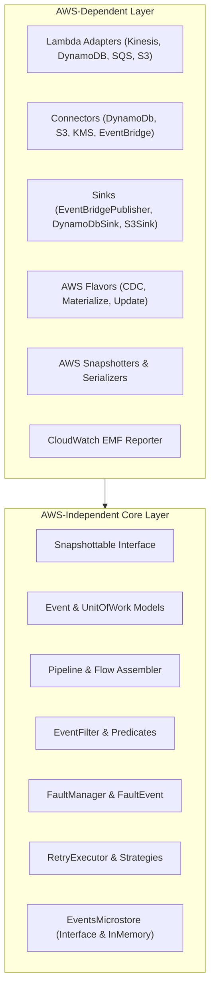

# Requirements

### Overview & Goals
The goal of this initiative is to cleanly separate all AWS-dependent classes (such as AWS SDK v2 clients, AWS Lambda event models, and CloudWatch EMF reporters) from AWS-independent classes (such as core stream processing abstractions, coroutine Flow pipelines, serialization interfaces like `Snapshottable`, and generic retry logic) within the `:core` module.

### Scope
- **In Scope**:
  - Comprehensive classification of all existing classes and packages in `:core` into AWS-agnostic vs AWS-dependent categories.
  - Decoupling core utility files (such as `JsonUtils.kt` and `FaultManager.kt`) that currently have direct imports/dependencies on AWS SDK / Lambda runtime event classes.
  - Grouping and structuring packages so that AWS-independent components have zero dependency on AWS SDK types, while AWS-dependent components (connectors, event adapters, sinks, serializers) reside in dedicated AWS subpackages.
  - Ensuring `UnitOfWork`, `Event`, `Snapshottable`, `Pipeline`, `EventFilter`, and `RetryExecutor` operate entirely without AWS SDK dependencies.
  - Maintaining backward compatibility for consumers through deprecation bridges and typealiases where appropriate.
- **Out of Scope**:
  - Creating multi-module Gradle subprojects at this stage (retaining a single module as requested).
  - Altering external event JSON contracts or wire formats.

### Functional Requirements
- Core stream processing (`UnitOfWork`, `Event`, `Snapshottable`, `Pipeline`, `PipelineAssembler`, `EventFilter`, `RetryExecutor`) must be runnable in purely in-memory / non-AWS environments (e.g. testing with `EventsMicrostoreInMemory` or other event backends).
- AWS SDK types (`software.amazon.awssdk.*`, `com.amazonaws.services.lambda.runtime.events.*`) must be confined strictly to AWS adapter, connector, sink, and serializer packages.
- Fault management, snapshotting, and metrics must support extensible interfaces allowing non-AWS or custom implementations.

### Non-Functional Requirements
- **Zero API Breakage**: Preserve existing public API signatures and extension methods where consumers rely on them.
- **Test Integrity**: All existing Kotest / JUnit unit tests and example applications must continue to pass.
- **Replay & Fault Resubmission**: Maintain identical replay and fault handling behavior.

# Technical Design

### Current Implementation
Currently, all classes reside inside the `core` module under the root package `io.kopipes.aws.*`. While many classes are conceptually independent of AWS, several core utilities contain mixed dependencies:
- `JsonUtils.kt` imports `com.amazonaws.services.lambda.runtime.events.models.dynamodb.AttributeValue` directly inside `toJsonElement()`.
- `FaultManager.kt` imports `aws.smithy.kotlin.runtime.SdkBaseException` and `com.amazonaws.services.lambda.runtime.events.StreamsEventResponse`.
- Core data classes (`UnitOfWork`, `Event`, `Snapshottable`) are located alongside AWS-specific connectors and sinks.

---

### Classification Inventory

#### 1. AWS-Independent Classes (Pure Core Abstractions)
These classes have no technical requirement for AWS SDK or AWS Lambda runtime libraries:

| Category | Classes / Files | Responsibility |
| :--- | :--- | :--- |
| **Core Abstractions** | `Event.kt`, `JsonEvent.kt`, `EventCodec.kt`, `RawRecord.kt`, `JsonRaw`, `UnitOfWork.kt` | Core event models, raw record sealed interfaces, and unit of work context. |
| **Pipeline Engine** | `Pipeline.kt`, `PipelineBuilder.kt`, `PipelineAssembler.kt`, `CollectPipeline.kt`*, `CorrelatePipeline.kt`, `EvaluatePipeline.kt` | Flow pipeline orchestration, event filtering, and correlation. |
| **Filters & Routing** | `EventFilter.kt`, `EventFilters.kt`, `filters.kt` (generic predicates), `skip.kt` | Predicate-based flow filtering and routing logic. |
| **Serialization & Diagnostics** | `Snapshottable.kt`, `KotlinxEventCodec.kt`, `KotlinxSerializationStrategy.kt`, `UnitOfWorkSnapshotSerializer.kt`, `UnitOfWorkSnapshot.kt`, `ErrorSnapshot.kt`, `EventSnapshot.kt`, `SnapshotOptions.kt`, `SnapshotRedactor.kt` | Snapshot generation and generic event serialization. |
| **Fault Handling (Core)** | `FaultEvent.kt`, `FaultException`, `FaultEventFactory.kt`, core `FaultManager` logic | Event-driven fault capture, logging, and error queuing. |
| **Connectors & Sinks (Abstract)** | `EventPublisher.kt` (interface), `EventsMicrostore.kt` (interface), `BaseEventsMicrostore.kt`, `EventsMicrostoreInMemory.kt` | Pluggable store and publisher contracts with in-memory test implementations. |
| **Resilience & Metrics** | `RetryExecutor.kt`, `RetryStrategy`, `RetryConfig`, `CalculateMetrics.kt`, `MetricStats.kt`, `Timer.kt`, `PipelineMetrics.kt` | Exponential backoff retry engine and generic timing statistics. |
| **Utilities** | `flows.kt`, `omit.kt`, `LoggedLazy.kt`, `batch.kt`, `CopyFields.kt` | Generic Kotlin Coroutines and Flow helper utilities. |

---

#### 2. AWS-Dependent Classes
These classes directly import and interact with AWS SDK v2 clients or AWS Lambda event runtime models:

| Category | Classes / Files | AWS Dependency |
| :--- | :--- | :--- |
| **Lambda Event Adapters** | `KinesisAdapter.kt`, `DynamodbAdapter.kt`, `SqsAdapter.kt`, `S3Adapter.kt`, `SnsAdapter.kt`, `EventBridgeAdapter.kt`, `FirehoseAdapter.kt`, `CwAdapter.kt`, `CognitoAdapter.kt`, `RecordPair.kt`, `TableChangeEvent.kt` | `com.amazonaws.services.lambda.runtime.events.*` |
| **AWS Connectors** | `DynamoDbConnector.kt`, `S3Connector.kt`, `KmsConnector.kt`, `CloudWatchConnector.kt`, `EventBridgeConnector.kt`, `ClientFactory.kt`, `DynamoDbBatchGetRetryStrategy.kt`, `EventBridgeRetryStrategy.kt` | `software.amazon.awssdk.services.*` |
| **AWS Sinks & Stores** | `EventBridgePublisher.kt`, `DynamoDbSink.kt`, `S3Sink.kt`, `CloudWatchSink.kt`, `ClaimCheckStore.kt`, `EventsMicrostoreImpl.kt`, `DynamoDbUpdateExpression.kt` | `software.amazon.awssdk.services.dynamodb / s3 / eventbridge / cloudwatch` |
| **AWS Pipeline Flavors** | `CdcPipeline.kt`, `UpdatePipeline.kt`, `MaterializePipeline.kt`, `MaterializeS3Pipeline.kt` | AWS DynamoDB / S3 queries and mutations |
| **AWS Queries** | `DynamoDb.kt`, `DynamoDbQuery.kt`, `S3.kt`, `S3Query.kt`, `ClaimCheckRedeemer.kt` | AWS SDK query extensions |
| **AWS Extensions** | `DynamoDbExtensions.kt`, `S3Extensions.kt`, `EventBridgeExtensions.kt`, `CloudWatchExtensions.kt`, `EventsMicrostoreExtensions.kt` | Attaching AWS SDK requests/responses to `UnitOfWork` |
| **AWS Serialization & Snapshots** | `AwsRecordSerializers.kt`, `AwsSerializers.kt`, `DynamodbSerialization.kt`, `KinesisSerialization.kt`, `SqsSerialization.kt`, `DynamoDbRecordSnapshotter.kt`, `KinesisRecordSnapshotter.kt`, `SqsRecordSnapshotter.kt`, `S3Snapshot.kt` | Serializers and snapshotters for AWS SDK / Lambda event types |
| **AWS Metrics & Tools** | `EmfReporter.kt`, `ReplayEvents.kt`, `ResubmitFaults.kt`, `TestContext.kt`, `TestLogger.kt` | CloudWatch EMF and Lambda runtime context |
| **AWS Utils & Security** | `AttributeValueTransformer.kt`, `sdkav.kt`, `EncryptionUtils.kt`, `EventEncryption.kt`, `ttl.kt` | AWS KMS, DynamoDB AttributeValues, and TTL formatting |

---

### Proposed Package Structure

To maximize separation of concerns and maintain a one-way dependency (`io.kopipes.aws.*` $\rightarrow$ `io.kopipes.core.*`), the package hierarchy is organized as follows:

```
io.kopipes
│
├── core                                  // Pure, zero-AWS stream processing engine
│   ├── event                             // Core data models & interfaces
│   │   ├── Event.kt, JsonEvent.kt, EventCodec.kt
│   │   ├── RawRecord.kt, RawRecords.kt, JsonRaw.kt
│   │   ├── UnitOfWork.kt, GlobalRegistry.kt
│   │   └── EnvironmentConfig.kt (generic runtime parameters)
│   ├── pipeline                          // Coroutine Flow orchestration
│   │   ├── Pipeline.kt, PipelineBuilder.kt, PipelineAssembler.kt
│   │   └── CollectPipeline.kt, CorrelatePipeline.kt, EvaluatePipeline.kt
│   ├── filters                           // Predicate routing & filtering
│   │   ├── EventFilter.kt, EventFilters.kt
│   │   └── filters.kt, skip.kt
│   ├── faults                            // Fault capture, dispatching, and exceptions
│   │   ├── FaultEvent.kt, FaultEventFactory.kt
│   │   └── FaultManager.kt (pluggable error classifier & handler)
│   ├── snapshots                         // Diagnostic state capture
│   │   ├── Snapshottable.kt, SnapshotOptions.kt, SnapshotRedactor.kt
│   │   ├── UnitOfWorkSnapshot.kt, UnitOfWorkSnapshotter.kt
│   │   └── ErrorSnapshot.kt, EventSnapshot.kt, RecordSnapshotter.kt
│   ├── serialization                     // Codecs & snapshot JSON serializers
│   │   ├── KotlinxEventCodec.kt, KotlinxSerializationStrategy.kt
│   │   └── UnitOfWorkSnapshotSerializer.kt
│   ├── retry                             // Generic retry engine & exponential backoff
│   │   └── RetryExecutor.kt, RetryStrategy.kt, RetryConfig.kt
│   ├── metrics                           // Generic timing & statistics aggregation
│   │   ├── PipelineMetrics.kt, CalculateMetrics.kt
│   │   └── MetricStats.kt, Timer.kt
│   ├── stores                            // Storage & publishing contracts
│   │   ├── EventPublisher.kt (interface), EventsMicrostore.kt (interface)
│   │   ├── BaseEventsMicrostore.kt
│   │   └── EventsMicrostoreInMemory.kt (pure in-memory test store)
│   └── utils                             // Kotlin Flow and transformation utilities
│       ├── flows.kt, batch.kt, omit.kt, CopyFields.kt
│       ├── LoggedLazy.kt, tags.kt
│       └── JsonUtils.kt (pure JSON element manipulation)
│
└── aws                                   // AWS SDK v2 & Lambda runtime integration
    ├── adapters (or from)                // Lambda event decoders -> Flow<UnitOfWork>
    │   ├── KinesisAdapter.kt, DynamodbAdapter.kt, SqsAdapter.kt
    │   ├── S3Adapter.kt, SnsAdapter.kt, EventBridgeAdapter.kt
    │   ├── FirehoseAdapter.kt, CwAdapter.kt, CognitoAdapter.kt
    │   └── RecordPair.kt, TableChangeEvent.kt
    ├── connectors                        // AWS SDK v2 client wrappers & retries
    │   ├── DynamoDbConnector.kt, S3Connector.kt, KmsConnector.kt
    │   ├── CloudWatchConnector.kt, EventBridgeConnector.kt, ClientFactory.kt
    │   └── DynamoDbBatchGetRetryStrategy.kt, EventBridgeRetryStrategy.kt
    ├── sinks                             // AWS emission sinks & persistent stores
    │   ├── EventBridgePublisher.kt, DynamoDbSink.kt, S3Sink.kt
    │   ├── CloudWatchSink.kt, ClaimCheckStore.kt, EventsMicrostoreImpl.kt
    │   └── DynamoDbUpdateExpression.kt
    ├── flavors                           // AWS pipeline workflows
    │   ├── CdcPipeline.kt, UpdatePipeline.kt
    │   └── MaterializePipeline.kt, MaterializeS3Pipeline.kt
    ├── queries                           // AWS SDK query helpers & claim-check redemption
    │   ├── DynamoDb.kt, DynamoDbQuery.kt, S3.kt, S3Query.kt
    │   └── ClaimCheckRedeemer.kt
    ├── extensions                        // UnitOfWork AWS context binding extensions
    │   ├── DynamoDbExtensions.kt, S3Extensions.kt
    │   ├── EventBridgeExtensions.kt, CloudWatchExtensions.kt
    │   └── EventsMicrostoreExtensions.kt
    ├── faults                            // AWS-specific fault handlers & responses
    │   └── LambdaStreamFaultExtensions.kt (StreamsEventResponse batch failure handling)
    ├── serialization                     // AWS SDK & Lambda model serializers/snapshotters
    │   ├── AwsRecordSerializers.kt, AwsSerializers.kt
    │   ├── DynamodbSerialization.kt, KinesisSerialization.kt, SqsSerialization.kt
    │   ├── DynamoDbRecordSnapshotter.kt, KinesisRecordSnapshotter.kt, SqsRecordSnapshotter.kt
    │   └── S3Snapshot.kt, AttributeValueCanonicalJson.kt
    ├── metrics                           // CloudWatch EMF metrics emission
    │   └── EmfReporter.kt, MetricsExtensions.kt
    ├── tools                             // AWS operational tools
    │   └── ReplayEvents.kt, ResubmitFaults.kt
    ├── utils                             // AWS crypto, attribute transformation & TTL
    │   ├── AttributeValueTransformer.kt, sdkav.kt
    │   └── EncryptionUtils.kt, EventEncryption.kt, ttl.kt
    ├── testsupport                       // AWS Lambda test context & test logger
    │   └── TestContext.kt, TestLogger.kt
    └── java                              // Java Lambda handler bridges
        └── Handlers.kt, PipelineRunner.kt
```

---

### Key Decoupling Points

1. **JsonUtils Separation**:
   - Remove `AttributeValue` pattern matching from `JsonUtils.kt`.
   - Implement `AttributeValue.toJsonElement()` in an AWS serialization/utility extension file (`io.kopipes.aws.serialization.aws` or `io.kopipes.aws.utils`).
2. **FaultManager Strategy**:
   - Extract `isRetryable(throwable: Throwable)` into a configurable predicate/strategy in core fault management.
   - Move `kinesisRetryableFailures()` / `StreamsEventResponse` handling into an AWS Lambda stream extension function on `FaultManager`.
3. **Environment & Registry Decoupling**:
   - Maintain generic config properties (stage, project, timeout, parallel) in core `EnvironmentConfig`.
   - Expose AWS-specific keys (DynamoDB table names, S3 bucket names, EventBridge buses) through AWS extension properties or sub-configuration.

---

### Architecture Diagram



# Testing

### Validation Approach
Verification will ensure strict architectural decoupling while ensuring all existing functionality, sample applications, and tests continue to work without regression.

### Key Scenarios
1. **AWS-Agnostic Core Pipeline Execution**:
   - Construct pipelines using `UnitOfWork`, `Event`, `EventFilter`, and `EventsMicrostoreInMemory`.
   - Verify pipeline execution, filtering, snapshotting, and fault emission without invoking any AWS SDK classes or mocks.
2. **Snapshottable & Snapshot Serialization**:
   - Verify `Snapshottable.toSnapshot()` produces accurate diagnostic state for pure objects as well as AWS extension objects.
   - Ensure `UnitOfWorkSnapshotSerializer` serializes snapshots without requiring AWS runtime classes.
3. **AWS Event Adapter & Connector Ingestion**:
   - Verify `KinesisAdapter`, `DynamodbAdapter`, and `SqsAdapter` properly transform Lambda events into `Flow<UnitOfWork>` and attach AWS snapshot data.
4. **Fault Handling & Batch Item Failures**:
   - Verify that AWS retryable exceptions (`SdkBaseException`) and `StreamsEventResponse.BatchItemFailure` continue to function correctly in Lambda stream handlers.

### Test Changes
- Retain all existing unit and integration tests across `:core` and `:examples`.
- Add test cases validating pure in-memory pipeline execution with zero AWS dependencies.

# Delivery Steps

### ✓ Step 1: Decouple core utilities and fault handling
Isolate AWS SDK and Lambda runtime types from core utilities and fault management.

- Refactor `JsonUtils.kt` to decouple the hardcoded `AttributeValue` reflection/conversion into an AWS-specific transformer/extension point.
- Refactor `FaultManager.kt` to extract AWS SDK retryable exception checking (`SdkBaseException`) and Lambda batch item failure response generation (`StreamsEventResponse.BatchItemFailure`) into pluggable strategies.
- Ensure `EnvironmentConfig` separates generic runtime properties (project, stage, batch size, timeouts) from AWS-specific parameters (DynamoDB tables, S3 buckets, EventBridge bus).
- Run and update unit tests for `JsonUtils` and `FaultManager`.

### ✓ Step 2: Isolate AWS-independent core abstractions
Group and consolidate all AWS-independent stream processing abstractions.

- Identify and organize the pure core interfaces and data classes: `Snapshottable`, `Event`, `JsonEvent`, `EventCodec`, `KotlinxEventCodec`, `RawRecord`, `JsonRaw`, `UnitOfWork`, `Pipeline`, `PipelineAssembler`, `PipelineBuilder`, and `RetryExecutor`.
- Consolidate AWS-agnostic filters (`EventFilter`, `EventFilters`, `skipTag`) and generic metrics calculators (`MetricStats`, `Timer`, `PipelineMetrics`).
- Verify that core abstractions have zero imports from `software.amazon.awssdk.*` and `com.amazonaws.services.lambda.*`.
- Add test coverage verifying that pure pipelines and unit-of-work flows execute independently without AWS classes.

### ✓ Step 3: Consolidate AWS connectors, adapters, and flavors
Group all AWS SDK-dependent and Lambda-dependent components into dedicated AWS subpackages.

- Consolidate AWS event adapters (`KinesisAdapter`, `DynamodbAdapter`, `SqsAdapter`, `S3Adapter`, `SnsAdapter`, `EventBridgeAdapter`, `FirehoseAdapter`, `CwAdapter`, `CognitoAdapter`) under `io.kopipes.aws.adapters` (or `io.kopipes.aws.from`).
- Consolidate AWS connectors and sinks (`DynamoDbConnector`, `S3Connector`, `KmsConnector`, `CloudWatchConnector`, `EventBridgeConnector`, `EventBridgePublisher`, `ClaimCheckStore`, `DynamoDbSink`, `S3Sink`, `EventsMicrostoreImpl`).
- Consolidate AWS pipeline flavors (`CdcPipeline`, `UpdatePipeline`, `MaterializePipeline`, `MaterializeS3Pipeline`) and AWS record serializers (`DynamodbSerialization`, `KinesisSerialization`, `SqsSerialization`, `AwsRecordSerializers`).
- Provide backward compatibility bridges and typealiases where required to prevent breaking existing consumer imports.

### ✓ Step 4: Validate test suites and backward compatibility
Run full test verification across unit tests, examples, and documentation.

- Run all unit tests in `:core` and sample applications to verify no regression in stream processing, serialization, replay, or fault handling.
- Verify `Snapshottable` snapshot generation and serialization across both pure and AWS-extended `UnitOfWork` instances.
- Update architectural documentation (`docs/ArchitecturalApproach.md`, `docs/modular-unit-of-work.md`) to reflect the separation boundaries.