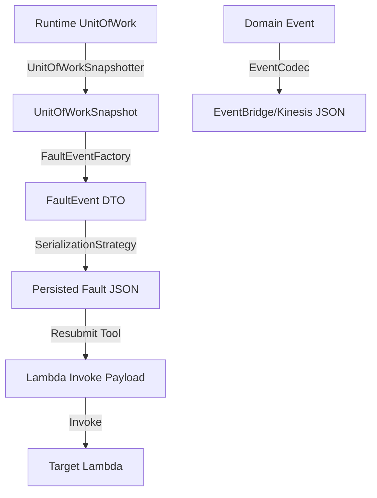

# Requirements

### Overview & Goals
Implement a robust serialization architecture that decouples the framework from specific JSON libraries (Jackson, kotlinx.serialization, Moshi) while improving the reliability and auditability of fault events.

The key outcome is moving away from serializing live runtime objects (like AWS SDK requests) and instead using stable, replayable snapshot DTOs.

### Scope
- **In Scope**:
  - Introduction of `SerializationStrategy` abstraction.
  - Snapshotting logic for `UnitOfWork` and Lambda records (Kinesis, DynamoDB).
  - Refactoring `FaultEvent` into a diagnostic DTO.
  - Updating `ResubmitFaults` tool to use the new snapshot format.
  - Deprecating legacy `Event.encoded()` and `asJson()`.
- **Out of Scope**:
  - Backward compatibility for existing persisted fault JSON.
  - Changes to the core event processing logic (outside of serialization).

### Functional Requirements
- Users can explicitly choose a serialization strategy or rely on unambiguous auto-detection.
- Fault events must contain all data necessary for replay in a stable format.
- Kinesis and DynamoDB records must be stored in their original Lambda trigger shape.
- Sensitive data redaction must be supported for snapshots.
- The resubmit tool must be able to recreate Lambda invocation payloads from the new snapshot format.

# Technical Design

### Current Implementation
- `FaultEvent` inherits from `BaseEvent` and stores raw `UnitOfWork` and `FaultException`.
- Serialization is heavily tied to Jackson via `JsonUtils.asJson()`.
- `EventBridgePublisher` calls `event.encoded()` which defaults to `asJson()`.
- `ResubmitFaults` parses the raw `UnitOfWork` JSON, which is brittle and contains unnecessary SDK internals.

### Key Decisions
- **Stable Snapshots**: Runtime objects will be converted to dedicated DTOs before serialization to avoid issues with non-serializable SDK classes.
- **Serialization Boundaries**:
  - **Domain Events**: Use `EventCodec`.
  - **Framework Diagnostics (Faults)**: Use `SerializationStrategy`.
- **Replay Payloads**: The `record.payload` field in a snapshot will contain the exact JSON object that can be wrapped in a `{"Records": [...]}` envelope for Lambda replay.
- **Fail-Fast Auto-Detection**: If multiple serializers are on the classpath, the framework will fail unless one is explicitly configured, preventing accidental choice.

### Proposed Changes
#### 1. Serialization Strategy Abstraction
```kotlin
interface SerializationStrategy {
    fun serialize(value: Any?): String
    fun <T : Any> deserialize(payload: String, targetType: Class<T>): T
}
```
Implementations: `JacksonSerializationStrategy`, `KotlinxSerializationStrategy`.

#### 2. UnitOfWorkSnapshot
A stable DTO containing only what's needed for diagnostics and replay.
```kotlin
data class UnitOfWorkSnapshot(
    val pipeline: PipelineSnapshot?,
    val record: ReplayRecordSnapshot?,
    val event: EventSummarySnapshot?,
    val batch: List<UnitOfWorkSnapshot>?,
    // ... other fields
)
```

#### 3. FaultEvent Refactoring
`FaultEvent` will no longer be an `Event`. It will be a standalone DTO.
```kotlin
data class FaultEvent(
    val id: String?,
    val type: String = "fault",
    val err: ErrorSnapshot?,
    val uow: UnitOfWorkSnapshot?,
    // Transient fields for in-memory use
)
```

#### 4. Event Codec
For domain events, allowing users to define how their specific events are serialized.
```kotlin
interface EventCodec {
    fun decode(payload: String): Event
    fun encode(event: Event): String
}
```

### Architecture Diagram


### File Structure
- `core/src/main/kotlin/.../serialization/`: `SerializationStrategy.kt`, `EventCodec.kt`, etc.
- `core/src/main/kotlin/.../faults/`: `FaultEvent.kt`, `UnitOfWorkSnapshot.kt`, `RecordSnapshotter.kt`, etc.
- `core/src/test/kotlin/.../`: Corresponding unit tests and golden JSON fixtures.

# Testing

### Validation Approach
Verification will be performed step-by-step as outlined in the plan. Each stage includes unit tests and integration tests.

### Key Scenarios
- **Serializer Selection**: Verify that Jackson, Kotlinx, and Auto-detection work as expected.
- **Snapshot Integrity**: Ensure that snapshots of Kinesis and DynamoDB records produce valid, replayable payloads.
- **Fault Persistence**: Verify that `FaultEvent` serialized to JSON contains the expected snapshot data and excludes raw SDK objects.
- **Resubmission**: Use the `ResubmitFaults` tool (in dry-run mode) to verify it generates the correct Lambda invocation payload from the new snapshot format.

### Golden JSON Fixtures
We will add "Golden JSON" files to the test resources to ensure the persisted contract remains stable:
- `kinesis-fault-event.json`
- `dynamodb-fault-event.json`
- `batched-fault-event.json`

# Delivery Steps

### ✓ Step 1: Foundation: Serialization Strategy and Resolver
Establish the new serialization framework while maintaining a path away from legacy methods.

- Create `SerializationStrategy` interface and `SerializationConfig`.
- Implement `SerializationStrategyResolver` with auto-detection logic.
- Add `JacksonSerializationStrategy` and `KotlinxSerializationStrategy`.
- Deprecate `Event.encoded()` to signal the move to the new architecture.

### ✓ Step 2: Snapshot Architecture: DTOs and Snapshotters
Define the data contracts for snapshots and implement the logic to capture them from runtime objects.

- Define typed DTOs for Kinesis and DynamoDB replay records.
- Create `UnitOfWorkSnapshot` and other supporting DTOs (Error, EventSummary, etc.).
- Implement `KinesisRecordSnapshotter` and `DynamoDbRecordSnapshotter`.
- Implement `DefaultUnitOfWorkSnapshotter` to convert runtime `UnitOfWork` to `UnitOfWorkSnapshot`.
- Add `FaultSnapshotOptions` and `SnapshotRedactor`.

### ✓ Step 3: Fault Management Refactor: DTOs and Publishing
Transition FaultEvent to a diagnostic-only DTO and update the framework to use it.

- Refactor `FaultEvent` to remove `BaseEvent` inheritance and use `UnitOfWorkSnapshot`.
- Implement `FaultEventFactory` to centralize fault creation and snapshotting.
- Update `FaultManager` to use `FaultEventFactory` for creating faults.
- Refactor `EventBridgePublisher` to use `SerializationStrategy` for framework DTOs.

### ✓ Step 4: Tools Integration and Final Cleanup
Ensure the resubmit tool works with the new format and finalize the domain event serialization.

- Update `ResubmitFaults` to extract replay payloads from the new snapshot structure (`uow.record.payload`).
- Add record-kind validation to the resubmit tool.
- Implement `JacksonEventCodec` and `KotlinxEventCodec` for domain events.
- Update domain event publishing to use `EventCodec`.
- Perform final cleanup of old JSON utilities like `asJson()`.
- (Optional) Add Moshi support.
