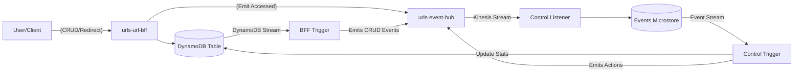

# Requirements

### Overview & Goals
The goal is to implement a new example project `urlshortener` within the `examples/` directory. This example will demonstrate how to use the `aws-lambda-stream-kotlin` framework with **Java** as the implementation language.

The example will follow the `urls` subsystem prefix and use `org.myorg.urls` as the base package.

The example will provide a URL shortener service with:
- A REST API (BFF) to manage URLs and handle redirections.
- An event hub for Kinesis-based event distribution.
- Event-driven processing via Kinesis and DynamoDB Streams.
- A control service that reacts to events and tracks usage statistics.

### Scope
- **In Scope**:
    - `common-app`: Shared events and codec in Java.
    - `common-infra`: Shared CDK base stack in Java.
    - `urls-event-hub`: Kinesis and EventBus infrastructure in Java.
    - `urls-url-bff`: REST API (CRUD & Redirection) and CDC trigger in Java.
    - `urls-control-service`: Event listener and stats-tracking trigger in Java.
    - Gradle configuration to integrate into the existing multi-project build.
- **Out of Scope**:
    - Frontend implementation.
    - Extensive unit tests for the example (basic validation only).

### Functional Requirements
- **URL Management**:
    - Create a short URL for a given long URL.
    - Delete a short URL.
    - Change a long URL associated with a short URL.
- **URL Access**:
    - Redirect a short URL to its corresponding long URL.
    - Keep track of the number of times each URL is accessed.
- **Event Emitting**:
    - Emit events whenever a URL is created, deleted, changed, or accessed.
- **Event Consumption**:
    - Collect events and allow further processing (e.g., stats aggregation).

# Technical Design

### Architecture
The `urlshortener` will follow the same pattern as the `sut` example but implemented in Java, using the `urls` subsystem prefix.



### Key Decisions
- **Implementation Language**: Java 21.
- **Base Package**: `org.myorg.urls`.
- **AWS SDK**: Kotlin AWS SDK (as it is the standard for the framework), used via `runBlocking` or similar bridges in Java.
- **Serialization**: Jackson for the Java-based events, with a custom `EventCodec` implementation.
- **Event Implementation**: Java Records will be used for events to ensure immutability and concise syntax.

### Proposed Changes
- **`io.github.huherto.awsLambdaStream.Event` Implementation in Java**:
  Java records will implement the `Event` interface. Since the interface has Kotlin default parameters for `copyEvent`, the Java implementation will provide the full method signature.
- **`JacksonEventCodec`**:
  A bridge class `JacksonEventCodec` will be implemented to satisfy the `EventCodec` interface while using Jackson's `ObjectMapper`.
- **Infrastructure**:
  The CDK stacks will be implemented in Java, inheriting from a Java version of `BaseStack`.
- **Pipeline Execution**:
  `io.github.huherto.awsLambdaStream.java.PipelineRunner` and `io.github.huherto.awsLambdaStream.java.Handlers` will be used to bridge Kotlin pipelines and coroutines to Java Lambda handlers.

### File Structure
```text
examples/urlshortener/
├── common-app/           # Shared Java Events & Codec
├── common-infra/         # Shared Java CDK Stacks
├── urls-event-hub/       # Java Kinesis/EventBus Infrastructure
├── urls-url-bff/
│   ├── app/              # Java Lambda Handlers (CRUD & Redirect)
│   └── infra/            # Java CDK Infrastructure
└── urls-control-service/
    ├── app/              # Java Lambda Handlers (Listener & Stats Trigger)
    └── infra/            # Java CDK Infrastructure
```

# Testing

### Validation Approach
- **Compilation**: The entire project must compile with `./gradlew build`.
- **Event Flow**: Verify that the Java-based `Trigger` can correctly emit events to Kinesis and the `Listener` can consume them.
- **Serialization**: Ensure `JacksonEventCodec` can round-trip `UrlEvent` objects correctly.

### Key Scenarios
- Creating a URL through the BFF results in a `UrlCreatedEvent` appearing in the Kinesis stream.
- Accessing a URL through the redirection endpoint emits a `UrlAccessedEvent`.
- The `urls-control-service` correctly records events and updates the access count in the primary table.
- Changing a URL generates a `UrlChangedEvent`.

# Delivery Steps

### ✓ Step 1: Initialize Project Structure and Common Modules (Java)
Set up the directory structure and Gradle configuration using the `urls` prefix and `org.myorg.urls` package.

- Update the root `settings.gradle.kts` to include the `urlshortener` modules.
- Create the root `build.gradle.kts` for the `urlshortener` example.
- Create the `common-app` and `common-infra` modules with their respective `build.gradle.kts` files.
- Implement the core domain entity `Url` as a Java Record, including `shortUrl`, `longUrl`, and `accessCount`.
- Implement the `UrlEvent` hierarchy (Created, Deleted, Changed, Accessed) using Java Records.
- Implement a `JacksonEventCodec` in Java to handle serialization/deserialization.

### ✓ Step 2: Implement urls-event-hub Infrastructure
Implement the event hub infrastructure in Java, mirroring `sut-event-hub`.

- Create the `urls-event-hub` module.
- Implement `EventHubStack` in Java, configuring the EventBus and Kinesis Stream.
- Set up archiving and CloudWatch logging for the bus.

### ✓ Step 3: Implement urls-url-bff Service
Implement the REST API for management and redirection, along with CDC logic.

- Implement the `UrlBffHandler` in Java:
    - CRUD endpoints: POST (create), DELETE, PATCH (change).
    - Redirection endpoint: GET `/{shortUrl}` that emits `UrlAccessedEvent`.
- Implement the `UrlDao` using the Kotlin AWS SDK for DynamoDB.
- Implement the `Trigger` handler using `PipelineRunner` and `Handlers.collectMetrics` to run a `CdcPipeline` that emits CRUD events to the Event Hub.
- Set up the CDK infrastructure for the BFF service.

### ✓ Step 4: Implement urls-control-service
Implement the event processing logic that reacts to events and tracks stats.

- Implement the `Listener` handler in Java using `PipelineRunner` and `Handlers.collectPipeline` to store events in the `EventsMicrostore`.
- Implement the `Trigger` handler using `PipelineRunner`, `Handlers.correlatePipeline`, and `Handlers.evaluatePipeline` to process `UrlAccessedEvent` and update the `accessCount` in DynamoDB.
- Set up the CDK infrastructure for the control service.

### ✓ Step 5: Finalize and Document the Example
Finalize the example with documentation and build verification.

- Add a `README.md` to the `urlshortener` example explaining how to build and deploy it.
- Ensure all Java implementations of `Event` methods (like `copyEvent`) are correctly handled.
- Verify that the example project can be built using the root Gradle task.