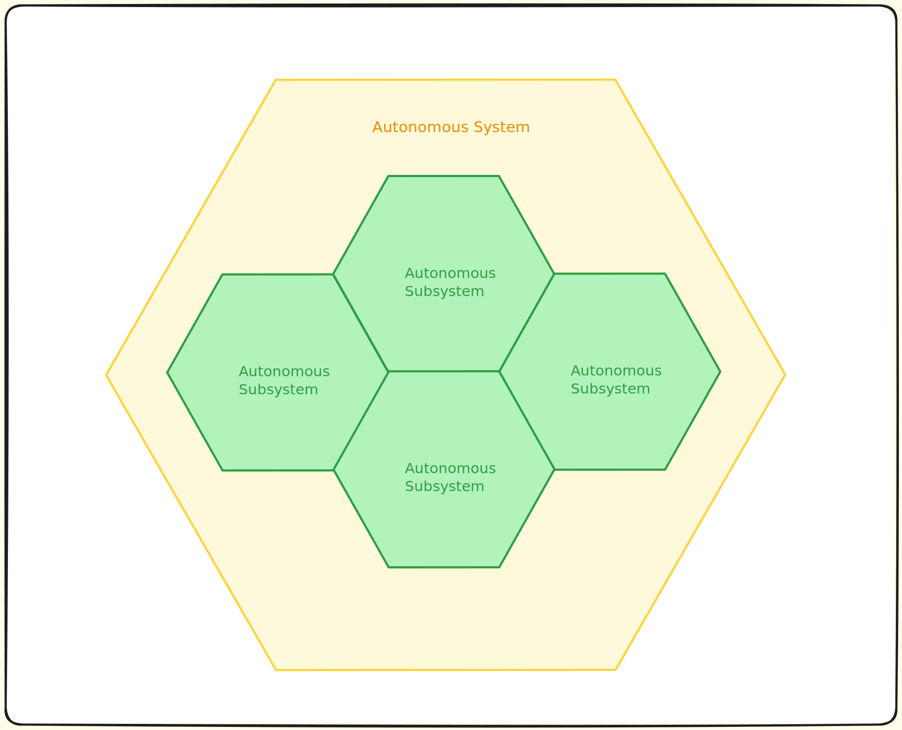
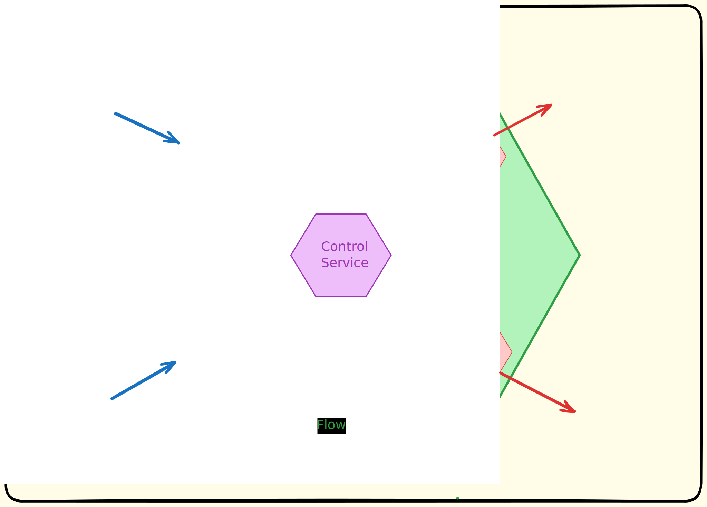

# Architectural Approach

Follow a structured approach to application architecture.

## Architectural Structure

 An *Autonomous System* is composed of one or more *Autonomous Subsystems*, each Autonomous Subsystem is in turn composed of one or more *Autonomous Services*.

Autonomous Services communicate with each other through (internal) domain events. The event format defines the contract between Autonomous Services.

Similarly, Autonomous Subsystems communicate with each other through (external) domain events or APIs. These communication mechanisms must have stable, well-defined contracts.

It is the responsibility of the solution architect to define the boundaries between subsystems and services, ensuring that each subsystem and service has a clear and well-defined purpose, interface and scope.

