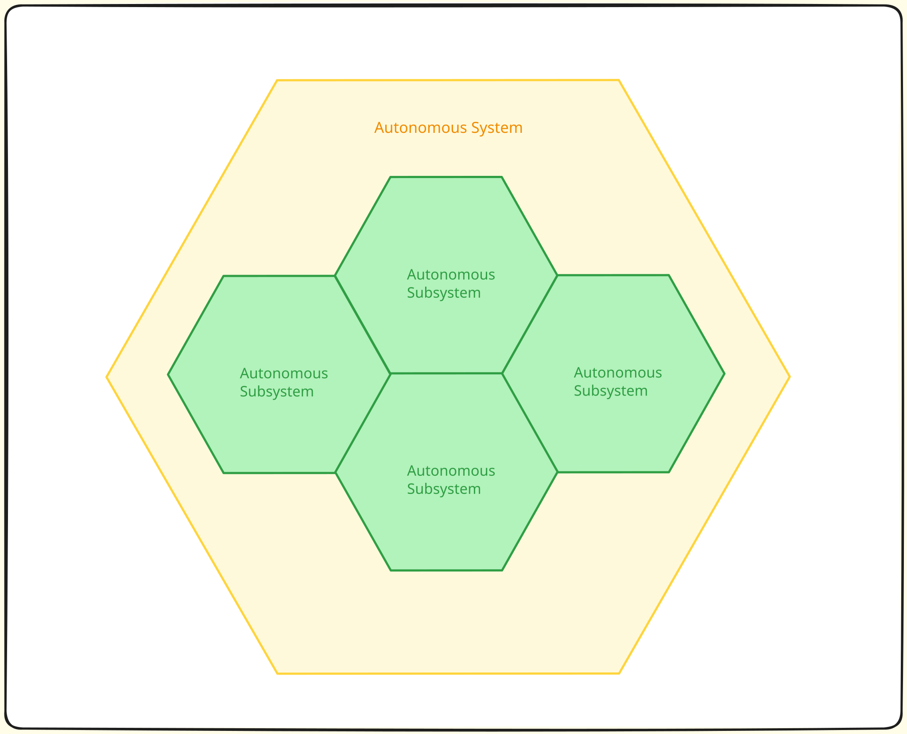
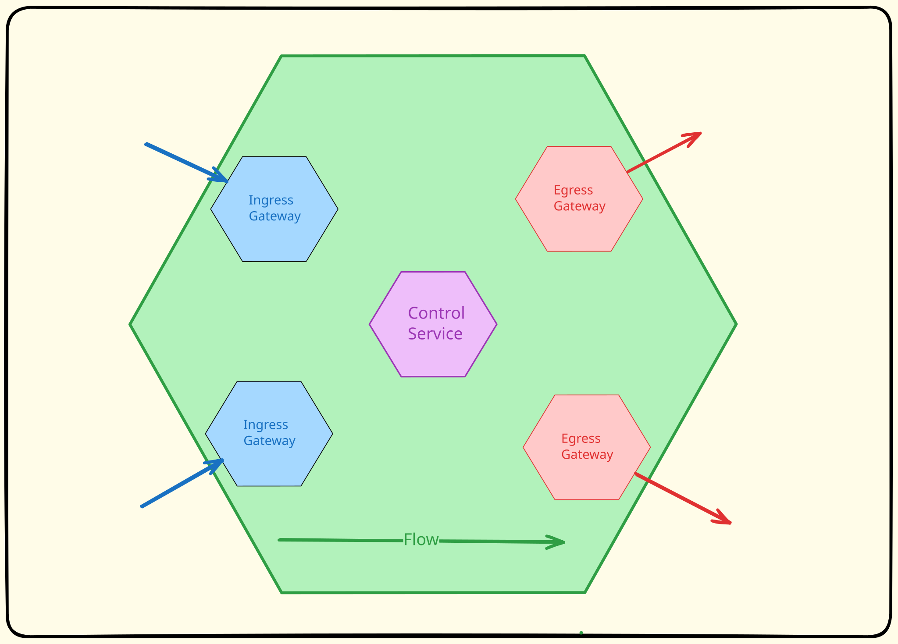

# Architectural Approach

Follow a structured approach to application architecture.

## Architectural Structure

 An *Autonomous System* is composed of one or more *Autonomous Subsystems*, each Autonomous Subsystem is in turn composed of one or more *Autonomous Services*.

Autonomous Services communicate with each other through (internal) domain events. The event format defines the contract between Autonomous Services.

Similarly, Autonomous Subsystems communicate with each other through (external) domain events or APIs. These communication mechanisms must have stable, well-defined contracts.

It is the responsibility of the solution architect to define the boundaries between subsystems and services, ensuring that each subsystem and service has a clear and well-defined purpose, interface and scope.

## Core vs AWS Integration Boundaries

The framework strictly separates core stream processing abstractions from cloud-specific (AWS) integrations:

1. **AWS-Agnostic Core (`io.kopipes.core.*`)**:
   - Contains core models (`UnitOfWork`, `Event`, `JsonEvent`, `RawRecord`, `JsonRaw`).
   - Contains Flow pipeline orchestration (`Pipeline`, `PipelineAssembler`, `PipelineBuilder`).
   - Contains predicate routing and filtering (`EventFilter`, `EventFilters`).
   - Contains resilient retry execution (`RetryExecutor`, `RetryStrategy`, `RetryConfig`).
   - Contains pluggable diagnostic snapshotting (`Snapshottable`, `UnitOfWorkSnapshotter`).
   - Contains decoupled fault management (`FaultManager`, `FaultEvent`, `RetryExceptionClassifier`).
   - Contains abstract microstore and publisher contracts (`EventsMicrostore`, `EventPublisher`, `EventsMicrostoreInMemory`).
   - Zero dependencies on AWS SDK or AWS Lambda runtime types.

2. **AWS Integrations (`io.kopipes.aws.*`)**:
   - Contains Lambda trigger event adapters (`KinesisAdapter`, `DynamodbAdapter`, `SqsAdapter`, `S3Adapter`, `EventBridgeAdapter`, etc.).
   - Contains AWS SDK v2 client wrappers and connectors (`DynamoDbConnector`, `S3Connector`, `KmsConnector`, `CloudWatchConnector`, `EventBridgeConnector`).
   - Contains AWS persistent sinks (`EventBridgePublisher`, `DynamoDbSink`, `S3Sink`, `EventsMicrostoreImpl`).
   - Contains AWS pipeline flavors (`CdcPipeline`, `UpdatePipeline`, `MaterializePipeline`, `MaterializeS3Pipeline`).
   - Contains CloudWatch EMF reporting and AWS-specific fault response helpers (`kinesisRetryableFailures`).

## Practical Example

For a concrete implementation of these concepts, see the [SUT Example Architecture](../examples/sut/architecture.md).

