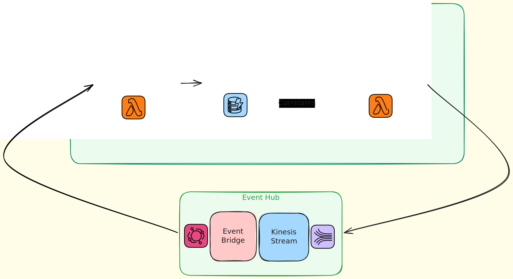

# Autonomous Service Types

## Table of Contents

- [Control Services](#control-services)
- [Event Hubs](#event-hubs)
- [External Service Gateways](#external-service-gateways)
  - [Ingress Gateways](#ingress-gateways)
  - [Egress Gateways]( #egress-gateways)
- [Backends for Frontends (BFFs)](#backends-for-frontends-bffs)
- [Fault Monitoring Services](#fault-monitoring-services)

## Control Services

Control Services orchestrate the flow of events within a subsystem.

They coordinate business processes, determine how events should be handled, and trigger the appropriate downstream actions.

A Control Service includes three main components:

- A Listener Lambda function that receives and processes incoming events.
- A DynamoDB table that stores events for correlation and evaluation.
- A Trigger Lambda function that correlates stored events, evaluates, and emits higher-order events to initiate downstream actions.

## Event Hubs

Event Hubs receive events from components within a subsystem and publish them to Kinesis Streams so they can be consumed by other components.

An Event Hub is typically composed of:

- AWS EventBridge
- One or more Kinesis Streams

Event Hubs provide a central point for event routing and distribution within a subsystem.

## External Service Gateways

External Service Gateways provide integration points between the sub-system and external services.

External Service Gateways act as an Anticorruption Layer (ACL), translating between internal events, external events, and external APIs. This prevents external models or contracts from leaking into the internal architecture.

They may receive events from other services, publish events to other other services, or interact with external APIs.

There are two types of External Service Gateways:

### Ingress Gateways

These services are used to receive events from external systems and publish them to the internal system. They convert the external event format to the internal event format.

### Egress Gateways

These services are used to publish events to external systems. They convert the internal event format to the external event format. Or they convert an internal event to a call to an external API.

## Backends for Frontends (BFFs)

BFFs provide APIs to the outside world.  They expose client-specific interfaces and adapt internal system capabilities to the needs of external consumers such as web applications, mobile applications, or third-party clients.

## Fault Monitoring Services
