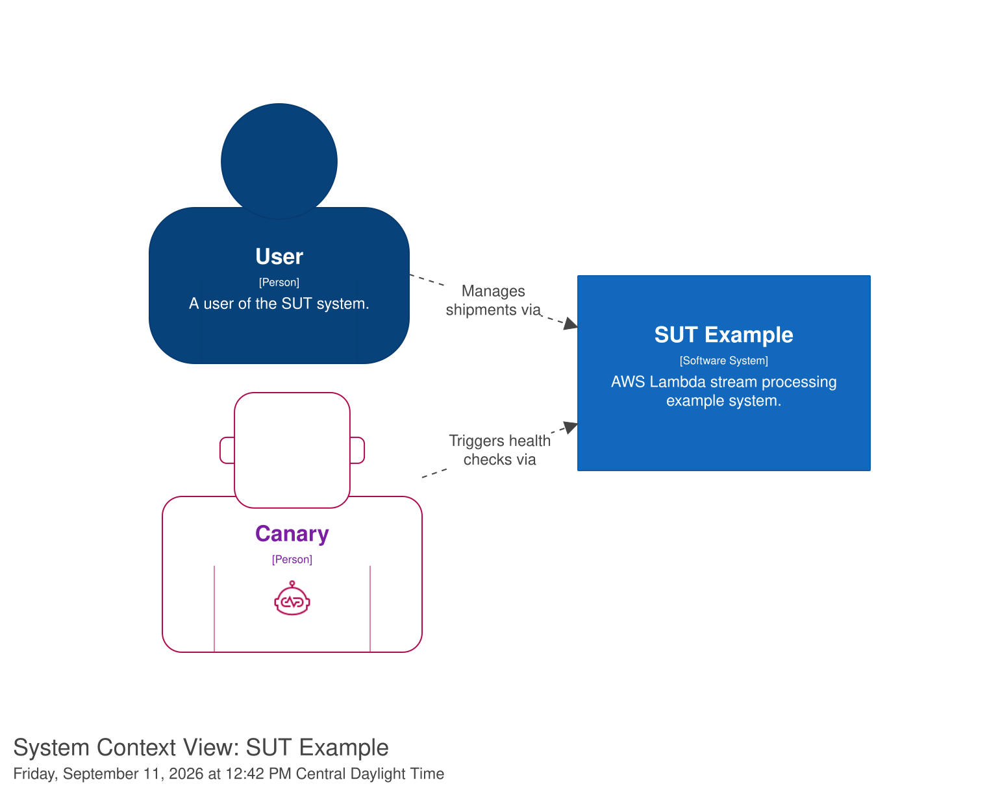
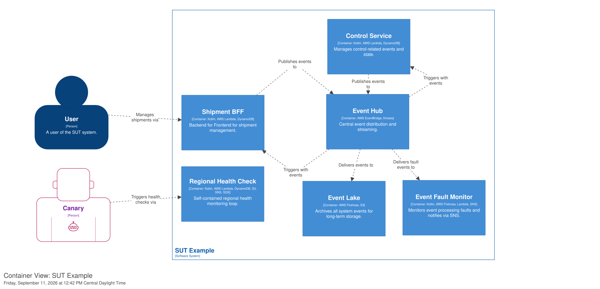
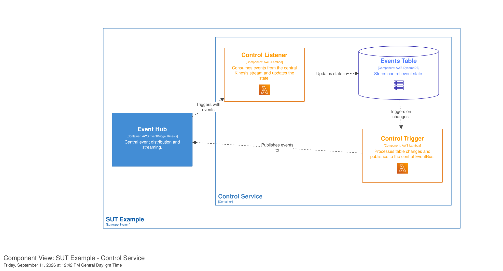
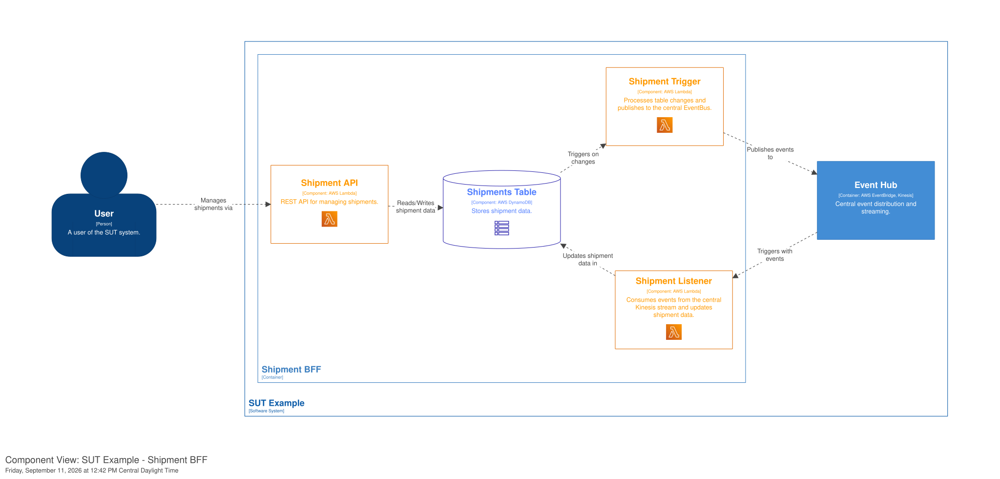
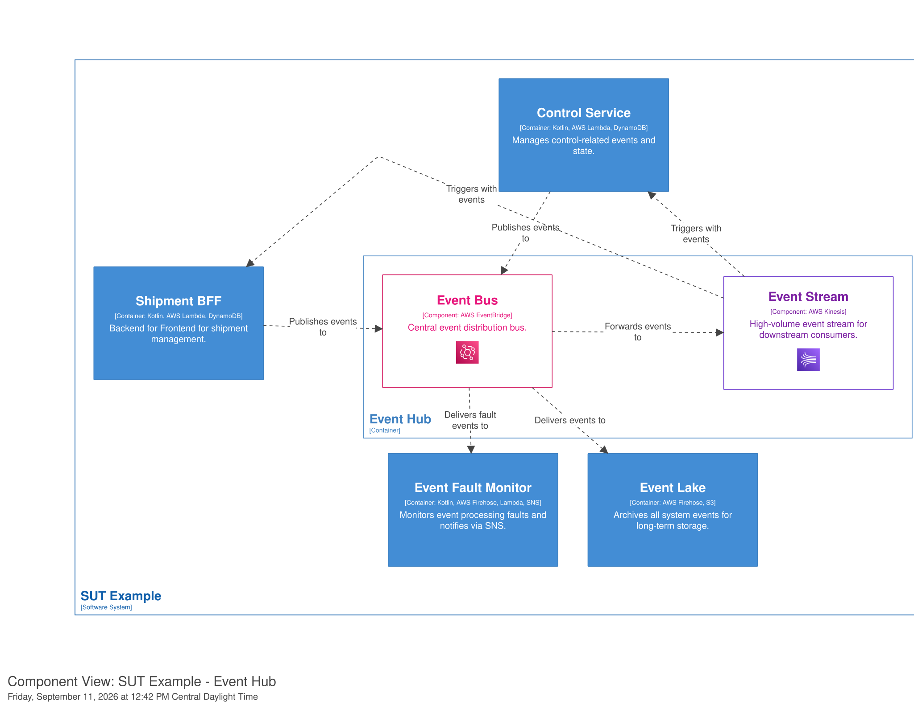
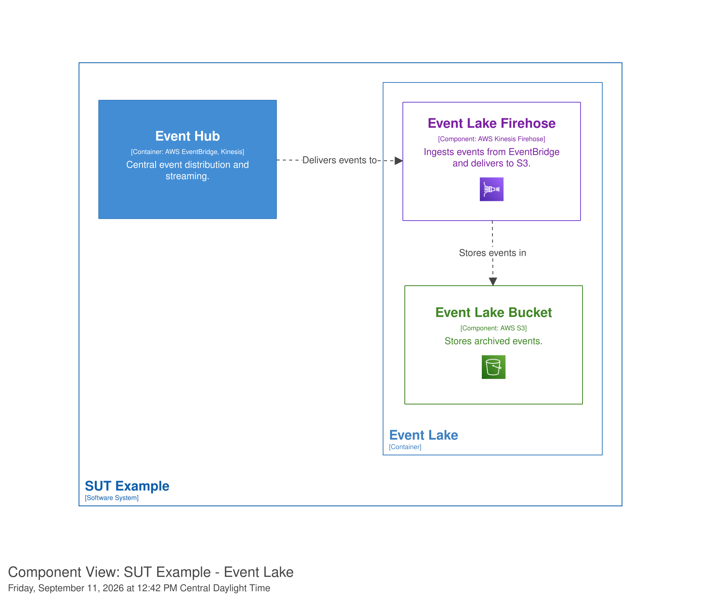
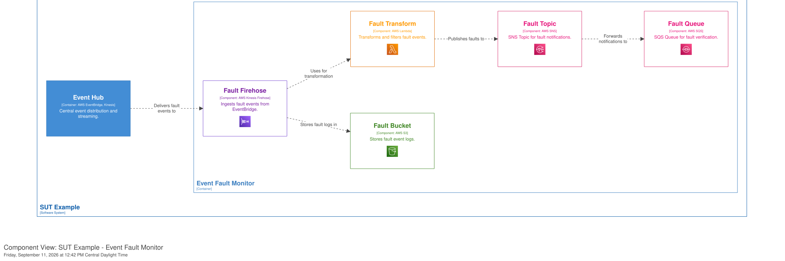

# SUT Example Architecture: Design Motivations

The SUT (Serialized Unit Tracking) Example is a reference implementation of a stream-processing architecture using the `aws-lambda-stream-kotlin` library. It demonstrates a system for tracking shipments or other entities using serial numbers. Beyond just describing the data flow, this document explains the **motivations** behind the key design choices that make the system resilient, scalable, and maintainable.

## Architectural Philosophy

The system is built on the principle of **Autonomous Subsystems**. Each subsystem owns its data, its logic, and its entry/exit points. This design addresses several distributed systems challenges:

- **Fault Isolation**: A failure in the Shipment BFF does not impact the Control Service's ability to process background tasks.
- **Independent Scalability**: High-traffic components (like the Shipment API) can be scaled independently of background processors.
- **Decoupled Evolution**: Subsystems communicate via stable event contracts, allowing internal implementations to change without affecting the rest of the system.

---

## Key Design Choices & Motivations

### 1. Event Hub: Hybrid Broker-Stream Model
**Components**: AWS EventBridge (Broker) + Amazon Kinesis (Stream)

*   **Motivation**: 
    - **EventBridge** provides flexible, rule-based routing and filtering. It acts as the central "post office" for the subsystem, allowing any service to subscribe to events without the producer knowing about them.
    - **Kinesis** provides high-throughput, ordered processing. While EventBridge is great for routing, Kinesis ensures that related events (e.g., all updates for a single shipment) are processed in the correct order and allows consumers to "replay" the stream from a specific point in time if needed.

### 2. Transactional Outbox Pattern
**Components**: DynamoDB + Lambda Trigger + EventBridge

*   **Motivation**: In a distributed system, updating a database and publishing an event are two separate operations. If one succeeds and the other fails, the system becomes inconsistent.
*   **Design Choice**: The SUT uses DynamoDB Streams (via the `Trigger` Lambda) to implement the **Transactional Outbox** pattern. Every write to the `Events Table` or `Shipments Table` automatically triggers an event publication. This guarantees **Atomic Consistency**: if the data is saved, the event *will* be published.

### 3. Events Microstore
**Components**: DynamoDB (within Control Service and Shipment BFF)

*   **Motivation**: Services often need to correlate multiple events (e.g., matching a "Shipment Created" event with a "Payment Confirmed" event). Querying a central event store or another service's database for this information creates tight coupling and performance bottlenecks.
*   **Design Choice**: The **Events Microstore** pattern maintains a local, queryable copy of only the events relevant to that service. It uses a specific schema (Partition Key = Entity ID, Sort Key = Event ID/Type) to allow high-performance correlation and evaluation close to the processing logic.

### 4. Event Lake
**Components**: Kinesis Firehose + Amazon S3

*   **Motivation**: Operational databases (DynamoDB) are optimized for current state, not historical analysis. Storing years of events in DynamoDB is expensive and inefficient for analytics.
*   **Design Choice**: The **Event Lake** provides long-term, immutable, and low-cost storage. It decouples the **System of Record** (current state) from the **System of Evidence** (audit trail). It is essential for compliance, business intelligence, and disaster recovery (re-populating a new database from scratch).

### 5. Fault Monitoring & Resubmission
**Components**: Kinesis Firehose + S3 + SNS + `resubmit-events` tool

*   **Motivation**: In stream processing, a single "poison pill" event (malformed data or a bug) can block the entire pipeline. Standard Lambda retries might fail indefinitely, leading to data loss or stuck streams.
*   **Design Choice**: Instead of blocking, the framework captures a **Snapshot of the Unit of Work** (original record + error details) and moves it to a dedicated Fault Bucket. This allows the pipeline to continue while providing developers with the exact context needed to fix the bug and **resubmit** the failed event later.

### 6. Active Health Check (The Tracer Loop)
**Components**: API -> DynamoDB -> S3 -> SNS -> SQS -> EventBridge -> Kinesis

*   **Motivation**: Passive monitoring (CPU, Memory, 5XX errors) only tells you if a service is "up." It doesn't tell you if the complex integration between services is actually *working*.
*   **Design Choice**: The **Tracer Loop** is a synthetic transaction that exercises the entire regional infrastructure. By flowing a test event through multiple AWS services and verifying its arrival at the end, the system proves that IAM roles, connectivity, and configurations are correctly set up across the whole stack.

### 7. Envelope Encryption
**Components**: AWS KMS + `EnvelopeEncryptionMetadata`

*   **Motivation**: Events in the Event Lake or Fault Bucket may contain sensitive information (PII). Relying solely on S3 bucket permissions is often insufficient for strict compliance requirements.
*   **Design Choice**: The architecture supports **Envelope Encryption**. Each event payload is encrypted with a unique data key, which is itself encrypted using a KMS Master Key. This ensures that even if the storage layer is accessed, the data remains protected and can only be decrypted by services with explicit KMS permissions.

---

## Visualizing the Architecture

### System Context
Demonstrates the high-level actors and their interaction with the autonomous system.

### Container View
Shows the boundaries between subsystems and the central role of the Event Hub.

### Service Internals (Examples)
These diagrams illustrate how the **Outbox** and **Microstore** patterns are implemented within specific services.

*   **Control Service**: Manages business process state using the Microstore pattern.
    
*   **Shipment BFF**: Provides an API while maintaining a materialized view of shipments via event consumption.
    
*   **Event Hub**: The backbone for reliable event distribution.
    
*   **Event Lake & Fault Monitor**: The infrastructure for durability and recovery.
    
    
