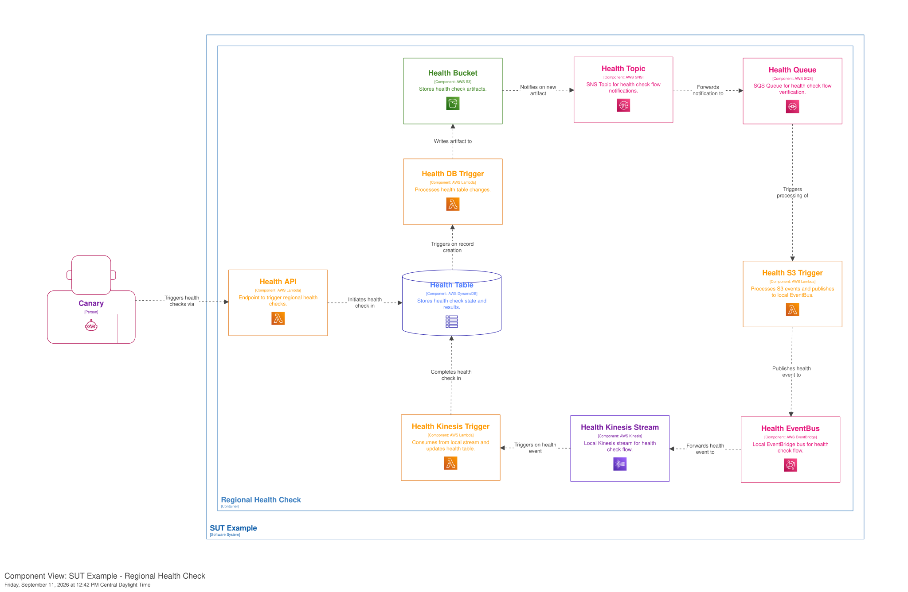

# SUT Example Architecture

> **Note**: This documentation is part of the [Structurizr model](structurizr/workspace.dsl) and reflects the system's design as defined in the C4 diagrams. For more information, visit the [Structurizr](https://structurizr.com/) home page.

## System Overview

This is an example on how to use this framework to build event-driven systems.  The SUT (Serialized Unit Tracking) system implements a robust, event-driven architecture designed for high reliability and observability. It tracks serialized units (such as shipments) through their lifecycle, ensuring that every state change is recorded, archived, and monitored.

### Architecture Diagrams

#### System Context

#### Container Diagram

### Service Descriptions

#### Event Hub
The central nervous system of the architecture. It combines **AWS EventBridge** for flexible, rule-based event routing and **AWS Kinesis** for high-throughput, ordered event streaming. By using both EventBridge and Kinesis, the system gains the best of both worlds: EventBridge simplifies event distribution to multiple consumers, while Kinesis allows consumers to process events in order and at their own pace, providing backpressure handling. In this case EventBridge is sending events to only one kinesis stream but it is totally possible to distribute the events to multiple kinesis streams or other targets such as SQS, cloudwatch logs, etc.

#### Control Service
Orchestrates the overall system flow by managing global control state. It uses a **Transactional Outbox pattern** implemented via DynamoDB Streams. Changes to the control state are captured by the `Control Trigger` and published to the `Event Hub`, ensuring that the system state and the event stream are always in sync.

#### Shipment BFF (Backend for Frontend)
Provides a dedicated interface for shipment-related operations, decoupling the frontend from the core domain logic. It maintains its own read model in a DynamoDB `Shipments Table`, which is updated asynchronously via the `Shipment Listener`. This allows the API to serve requests with low latency, even if the underlying event processing has some delay.

#### Event Lake
An immutable archive of every event that has ever passed through the system. Built with **Amazon Kinesis Data Firehose** and **Amazon S3**, it provides a low-cost, durable storage solution for auditing, compliance, and "time-travel" debugging where past events can be replayed to fix issues or populate new services.

#### Event Fault Monitor
A specialized monitoring service that catches and alerts on processing failures. It extracts fault information from the event stream and uses an **SNS FIFO Topic** to ensure that notifications are delivered at most once (deduplication), preventing alert fatigue during system-wide outages.

#### Regional Health Check (Tracer Loop)
A proactive monitoring tool that continuously validates the end-to-end health of the regional infrastructure. It functions as a **Synthetic Canary** that initiates a "tracer" event. This event must successfully traverse through DynamoDB, S3, SNS, SQS, EventBridge, and Kinesis before returning to the Health Table. If the loop is broken, it signals a failure in one of the underlying AWS services or the system's configuration. Traffic can be redirected out of unhealthy regions.

