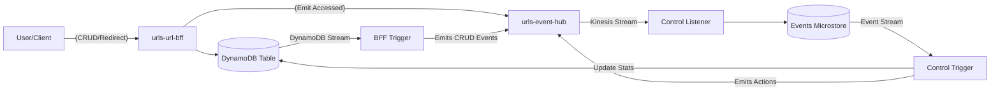

# URL Shortener Example (Java)

This is an example project demonstrating how to use the `aws-lambda-stream-kotlin` framework with **Java** as the implementation language.

## Architecture

The example follows a typical serverless architecture:

1.  **urls-url-bff**: A REST API to create, delete, and update URLs. It also provides a redirection endpoint.
2.  **urls-event-hub**: A Kinesis-based event distribution hub.
3.  **urls-control-service**: Processes events to track usage statistics.



## Key Features

-   **Java 21** implementation using Java Records for events and entities.
-   **Jackson** for JSON serialization/deserialization.
-   **Kotlin AWS SDK** usage from Java via coroutine bridges.
-   **CDK** infrastructure defined in Java.
-   Uses `PipelineRunner` and `Handlers` for Java-friendly pipeline execution.

## Building

To build the entire example:

```bash
./gradlew :examples:urlshortener:common-app:build
./gradlew :examples:urlshortener:urls-url-bff:app:build
./gradlew :examples:urlshortener:urls-control-service:app:build
```

## Deployment

Each service has its own CDK infrastructure module. You can deploy them using the CDK CLI from their respective `infra` directories.

```bash
cd examples/urlshortener/urls-event-hub/infra
cdk deploy "*"
```

(Note: Ensure you have the necessary AWS credentials and environment variables configured).
